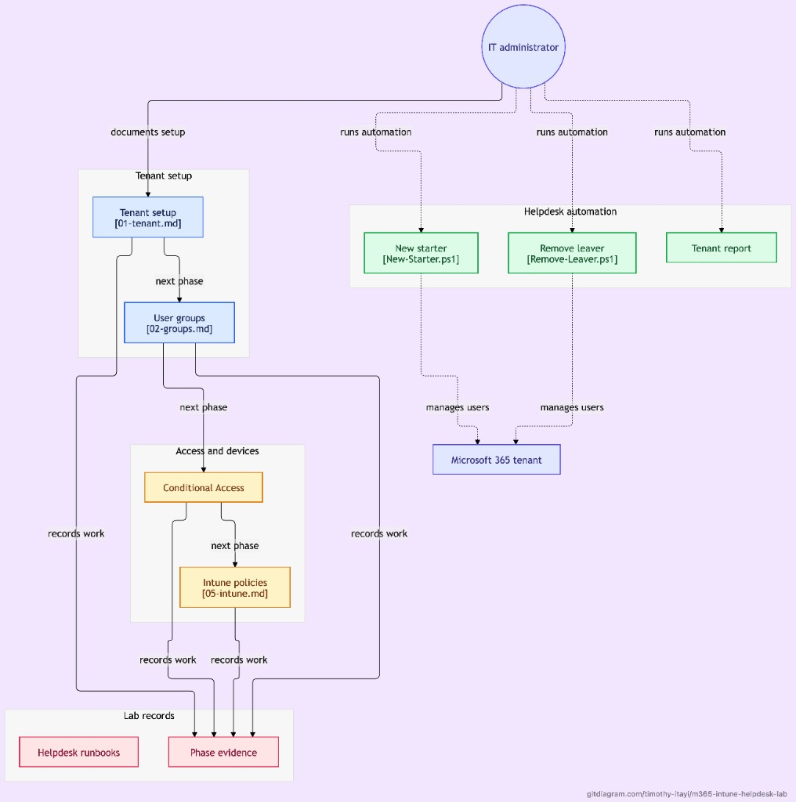

# m365-intune-helpdesk-lab

A small-business IT environment run the way a service desk or MSP runs one, built on a Microsoft 365 Business Premium trial tenant with fictional users. It covers tenant setup, users and dynamic groups, PowerShell automation for joiners and leavers, MFA and Conditional Access, and Intune policy configuration.

Setup: MacBook + Docker Desktop. The tenant is a temporary lab, so the screenshots and write-ups in this repo are the record.

## What I built

- **Tenant and identity:** a Microsoft 365 tenant with an admin account secured with MFA, a break-glass emergency account, and six starter accounts across Sales, Operations and Finance.
- **Dynamic groups:** `DG-Sales`, `DG-Operations` and `DG-Finance` populate automatically from each user's department attribute, plus an assigned group, `SG-All-Staff`.
- **Joiner and leaver automation:** PowerShell 7 and Microsoft Graph scripts, run in Docker, that create a user, assign a licence and log the action, and that offboard a leaver by blocking sign-in, revoking sessions, removing licences and group memberships. Both support `-WhatIf`, run pre-checks and write to an action log. A third script exports a tenant report.
- **Least privilege:** the Helpdesk Administrator role, tested so it can reset a standard user's password but cannot create users.
- **MFA and Conditional Access:** security defaults replaced by three Conditional Access policies in report-only mode (require MFA, block legacy authentication, require a compliant device), and a standard user who registered Microsoft Authenticator and completed an MFA sign-in.
- **Intune policy configuration:** MDM user scope for automatic enrolment, a Windows compliance policy, a settings catalog configuration profile, an update ring and a Windows Terminal app assignment.
- **Runbooks:** six runbooks in one layout, built from the steps above.

## Skills demonstrated

Microsoft 365 administration, Entra ID, user and licence administration, dynamic groups, Microsoft Graph, PowerShell automation, MFA, Conditional Access policy design, Intune policy configuration, Docker, and documentation.

## Overview



## Documentation

| Section | What's in it |
| --- | --- |
| [docs/phases](docs/phases/01-tenant.md) | One note per phase: objective, what was done, evidence |
| [docs/decisions](docs/decisions/README.md) | Why things were built the way they were, numbered in order |
| [docs/runbooks](docs/runbooks/README.md) | Step-by-step guides for common tasks and faults |
| [docs/incidents](docs/incidents/00-setup.md) | Setup incident reports: what broke, root cause, resolution, lessons learned |
| [docs/worklog](docs/worklog/setup-00.md) | Session-by-session log of what was done and learned |
| [evidence](evidence/00-setup/00.md) | Step-by-step write-ups with screenshots, one folder per phase |

Each numbered file links to the one before it, so the trail reads in order from `00`.

## Phases

| Phase | Status | Note | Evidence | Decisions |
| --- | --- | --- | --- | --- |
| Setup | Done | [worklog](docs/worklog/setup-00.md) | [00-setup](evidence/00-setup/00.md) | [00.md](docs/decisions/00.md), [02-setup.md](docs/decisions/02-setup.md) |
| 1: Tenant | Complete | [01-tenant.md](docs/phases/01-tenant.md) | [01-tenant](evidence/01-tenant/00-Secure-first-admin.md) | [03-tenant.md](docs/decisions/03-tenant.md) |
| 2: Groups | Complete | [02-groups.md](docs/phases/02-groups.md) | [02-groups](evidence/02-groups/00-dg-sales-rule.md) | [04-groups.md](docs/decisions/04-groups.md) |
| 3: Scripts | Complete | [03-scripts.md](docs/phases/03-scripts.md), [scripts/](scripts/README.md) | [03-scripts](evidence/03-scripts/00-connect-mggraph.md) | [05-scripts.md](docs/decisions/05-scripts.md) |
| 4: Conditional Access | Configured (report-only) | [04-conditional-access.md](docs/phases/04-conditional-access.md) | [04-conditional-access](evidence/04-conditional-access/00-security-defaults-off.md) | [06-conditional-access.md](docs/decisions/06-conditional-access.md) |
| 5: Intune | Configured | [05-intune.md](docs/phases/05-intune.md) | [05-intune](evidence/05-intune/00-mdm-user-scope.md) | [07-intune.md](docs/decisions/07-intune.md) |

### Setup trail

| Step | Evidence | Decision | Incident |
| --- | --- | --- | --- |
| 00: osTicket and MariaDB | [00.md](evidence/00-setup/00.md) | [00.md](docs/decisions/00.md) | [00-setup.md](docs/incidents/00-setup.md) |
| 01: PowerShell Docker image | [01.md](evidence/00-setup/01.md) | [02-setup.md](docs/decisions/02-setup.md) | [01-setup.md](docs/incidents/01-setup.md) |

## Running PowerShell

PowerShell runs in a container, not on macOS. Build the image once, then enter it from the repo root:

```bash
docker build --progress=plain -t m365-helpdesk-pwsh .
docker run --rm -it -v "$PWD":/work m365-helpdesk-pwsh pwsh
```

Type `exit` to leave the container. Closing it drops the Microsoft Graph session, so reconnect with the steps in [scripts/README.md](scripts/README.md).

Details and verification: [evidence/00-setup/01.md](evidence/00-setup/01.md)

## Repository layout

```text
docs/         phases, decisions, runbooks, incidents, worklog
evidence/     one folder per phase, with step write-ups and images/
scripts/      PowerShell automation: New-Starter, Remove-Leaver, Get-TenantReport
Dockerfile    PowerShell + Microsoft Graph image (arm64)
```

`evidence-raw/` and `logs/` are local only and gitignored.
