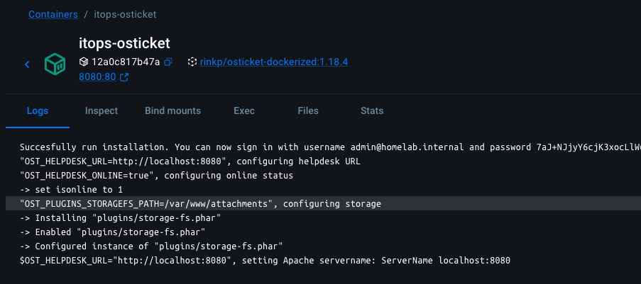
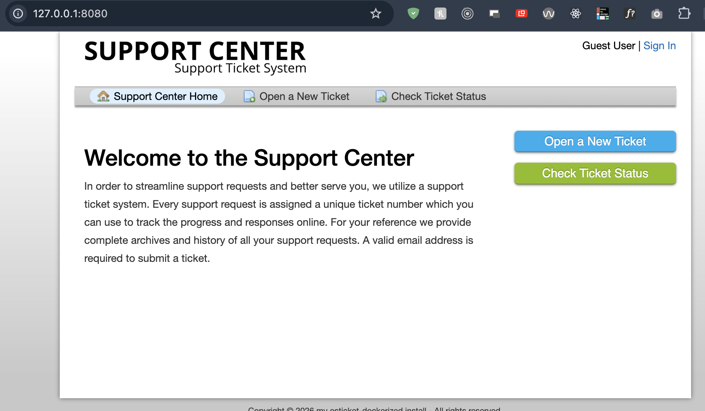

# Incident Report — osTicket MariaDB Authentication Failure

**System:** osTicket Lab  
**Service:** MariaDB / osTicket  
**Issue Type:** Database Authentication Failure

Related: [osTicket Lab Setup](../../evidence/00-setup/00.md) (setup and screenshots), [decisions](../decisions/00.md)

## Summary

While setting up the osTicket project for a second time to continue using it as an IT support lab, osTicket was unable to connect to the MariaDB database.

The application returned a PHP `mysqli` connection error during installation.

MariaDB logs showed:

```text
Access denied for user 'osticket'@'172.18.0.3' (using password: YES)
```

## Investigation

Docker networking was functioning correctly because the osTicket container was successfully reaching the MariaDB container on port `3306`.

The problem was isolated to database authentication.

The Docker Compose configuration used the same environment variable for both services:

```yaml
MARIADB_PASSWORD: ${OST_DB_PASSWORD}
OST_DBPASS: ${OST_DB_PASSWORD}
```

However, MariaDB was using an existing persistent Docker volume from the previous deployment.

MariaDB credentials are created when the database is first initialised. Changing the password in the `.env` or Docker Compose configuration does not automatically update the credentials already stored inside an existing database volume.

I also discovered that the MariaDB root account had originally been configured with:

```yaml
MARIADB_RANDOM_ROOT_PASSWORD: "yes"
```

I had not retained the randomly generated root password, so I could not log in as root to reset the `osticket` database user's credentials.

## Root Cause

The existing MariaDB Docker volume contained credentials from the original deployment that no longer matched the current `OST_DB_PASSWORD`.

The randomly generated MariaDB root password had also not been retained, preventing normal administrative recovery.

## Resolution

Because this was a lab environment and the existing database data was not required, the MariaDB database volume was removed and recreated.

MariaDB was then able to initialise a new `osticket` database and user using the current credentials defined in the environment configuration.

The osTicket and MariaDB containers could then authenticate using the same `OST_DB_PASSWORD`.

## Evidence

The `Access denied` line above is quoted from the MariaDB log. The screenshots below show the state after the fix.

Container logs after the successful install (`itops-osticket`, image `rinkp/osticket-dockerized:1.18.4`, port `8080:80`, `Successfully run installation.`):



Support Center reachable at `127.0.0.1:8080`, so osTicket connects to MariaDB:



Full setup write-up: [evidence/00-setup/00.md](../../evidence/00-setup/00.md)

## Lessons Learned

- Docker environment variables do not overwrite database credentials stored in an existing MariaDB volume.
- Check application and database logs before assuming a networking problem.
- An `Access denied` message confirms the application is reaching the database but authentication is failing.
- Avoid random root credentials in a reusable lab unless the generated password is securely recorded.
- Keep the MariaDB root password separate from the application database user's password.
- Do not delete persistent database volumes until confirming that the stored data is no longer required.