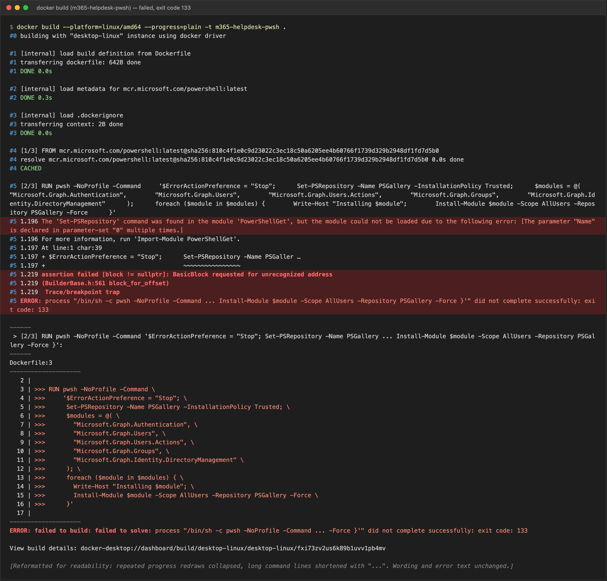

# Incidents

Previous: [00-setup.md](00-setup.md) (osTicket MariaDB authentication failure)

Index of incident reports for this lab.

| Report | Topic |
| --- | --- |
| [00-setup.md](00-setup.md) | osTicket / MariaDB authentication failure |
| [Docker build failure on Apple Silicon](#incident-docker-build-failure-on-apple-silicon) | PowerShell image crashes under amd64 emulation |

---

## Incident: Docker build failure on Apple Silicon

**System:** Local Docker Desktop (Apple Silicon, arm64 host)
**Service:** `m365-helpdesk-pwsh` image (PowerShell + Microsoft Graph modules)
**Issue Type:** Build failure (exit code 133)

Related: [00-setup.md](00-setup.md) covers the earlier osTicket / MariaDB setup incident from the same lab.

### Summary

`docker build` failed at the `RUN pwsh ... Install-Module` step of the `Dockerfile`:

```bash
docker build --platform=linux/amd64 --progress=plain -t m365-helpdesk-pwsh .
```

Relevant log output:

```text
The 'Set-PSRepository' command was found in the module 'PowerShellGet', but the module
could not be loaded due to the following error:
[The parameter "Name" is declared in parameter-set "0" multiple times.]

assertion failed [block != nullptr]: BasicBlock requested for unrecognized address
(BuilderBase.h:561 block_for_offset)
Trace/breakpoint trap
exit code: 133
```

Full build output from the failed run (`powershell:latest` with `--platform=linux/amd64`):



This image is a rendering of the captured terminal text, not a native screenshot. Repeated progress redraws were collapsed and long lines shortened with `...`. The error text is unchanged.

### Investigation

- The base image was `mcr.microsoft.com/powershell:latest`. I assumed Docker would pull an arm64 variant automatically.
- Checking the MCR manifest for `powershell:latest` showed only `linux/amd64`, `linux/arm/v7` and `windows/amd64`. There is no `linux/arm64` entry.
- The `ubuntu-*`, `debian-*` and `alpine-*` tags I checked are also amd64-only. Swapping `latest` for another version or distro tag does not change the architecture.
- Because the build was run with `--platform=linux/amd64`, the amd64 image was executed under emulation on the arm64 host.
- The `BasicBlock requested for unrecognized address` assertion comes from the x86-to-ARM translation layer, not from PowerShell or the Dockerfile. PowerShell is .NET and relies on a runtime JIT, which translators are known to handle badly.
- The `PowerShellGet` load error appeared in the same emulated process just before the trap. It is likely the same failure surfacing earlier, but this was not proven.

### Root Cause

The image was built as `linux/amd64` on an arm64 host, so PowerShell ran under emulation and crashed. The `latest` tag has no native arm64 image, so the emulation was unavoidable with that tag.

### Resolution

Use a native arm64 tag and build without `--platform=linux/amd64`. MCR publishes arm64 images as separate tags with the architecture in the name:

- `mcr.microsoft.com/powershell:lts-azurelinux-3.0-arm64`
- `mcr.microsoft.com/powershell:7.5-azurelinux-3.0-arm64`
- `mcr.microsoft.com/powershell:azurelinux-3.0-arm64`

```dockerfile
FROM mcr.microsoft.com/powershell:lts-azurelinux-3.0-arm64
```

```bash
docker build --progress=plain -t m365-helpdesk-pwsh .
```

**Status:** The arm64 tags were confirmed to exist in the registry. The rebuilt image has not been verified yet. If the build still fails on native arm64, treat the `PowerShellGet` error as a separate problem.

### Lessons Learned

- Do not assume `latest` is multi-arch. Check the manifest for the platforms it lists.
- `--platform=linux/amd64` on Apple Silicon means emulation, and JIT-based runtimes such as .NET can crash under it.
- Trace/breakpoint traps and assertion failures in translator source files (for example `BuilderBase.h`) point to the emulation layer, not the application.
- Pin an explicit version tag in the `Dockerfile` instead of `latest`.
- A hard-coded `-arm64` tag breaks builds on x86 hosts and CI runners. Use a build argument if the image needs to build on both.
