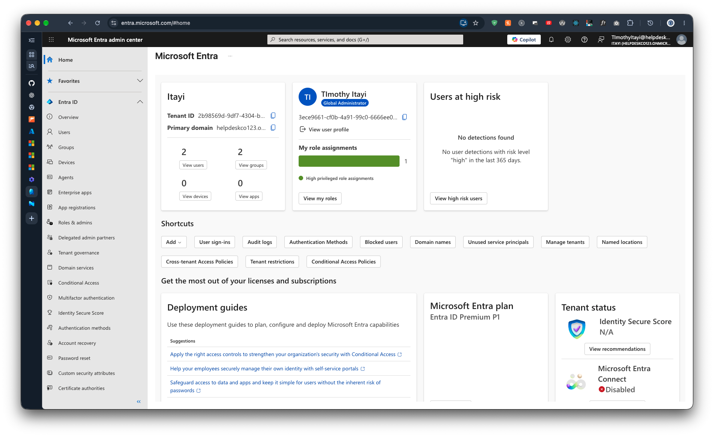
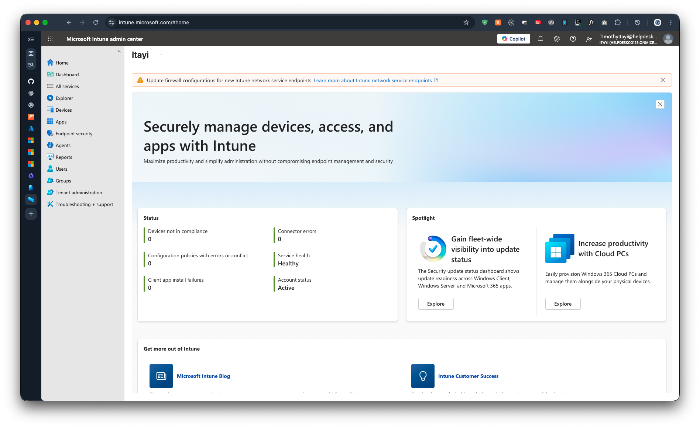

# Phase 1: Tenant setup

Previous phase note: none. Setup trail before this phase: [evidence 01](../../evidence/00-setup/01.md).

## Objective

Create an isolated Microsoft 365 tenant to act as a small business environment.

## What I did

1. Signed up for a Business Premium trial with a new email so it is a separate tenant.
2. Turned off recurring billing and set a reminder for day 25.
3. Registered MFA for the primary admin.
4. Created a break-glass Global Admin with no licence; credentials stored in a password manager.
5. Confirmed licences and opened the three admin portals.

## Evidence

Step write-ups, in order:

1. [Secure the first admin](../../evidence/01-tenant/00-Secure-first-admin.md)
2. [Break-glass account](../../evidence/01-tenant/01-break-glass-account.md)
3. [Check licences](../../evidence/01-tenant/02-check-licences.md)
4. [Recurring billing off](../../evidence/01-tenant/03-billing-recurring-off.md)
5. [Microsoft 365 admin center](../../evidence/01-tenant/04-m365-admin-center.md)
6. [Entra admin center](../../evidence/01-tenant/05-entra-admin-center.md)
7. [Intune admin center](../../evidence/01-tenant/06-intune-admin-center.md)

Decisions: [03-tenant.md](../decisions/03-tenant.md)

Screenshots:

- 
- 
- 
- 
- 

## Issues and fixes

None.

## What I'd do differently in production

- Use least-privilege admin roles for daily work instead of Global Admin.
- Monitor sign-ins of the break-glass account and alert when it is used.

## Checkpoint

You can sign in to all three portals, licences show available, billing is off, break-glass exists.
