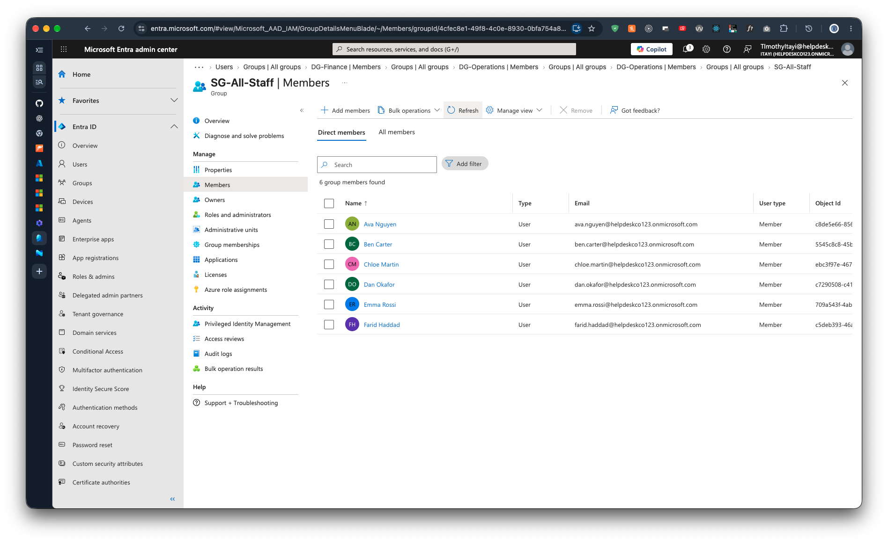

# Phase 2: Groups

Previous: [01-tenant.md](01-tenant.md)

Decisions: [04-groups.md](../decisions/04-groups.md)

## Objective

Make access follow attributes instead of manual admin work.

## Design

| Group | Type | Rule / membership | Purpose |
|---|---|---|---|
| DG-Sales | Dynamic | user.department -eq "Sales" | Sales team access and policies |
| DG-Operations | Dynamic | user.department -eq "Operations" | Operations team |
| DG-Finance | Dynamic | user.department -eq "Finance" | Finance team |
| SG-All-Staff | Assigned | manual | Target for company-wide policies |

## Why dynamic groups

When someone changes department, their group membership updates without an admin
touching it, reducing forgotten access after moves.

## Evidence

Step write-ups, in order:

1. [DG-Sales rule](../../evidence/02-groups/00-dg-sales-rule.md)
2. [Groups list](../../evidence/02-groups/01-groups-list.md)
3. [DG-Sales members](../../evidence/02-groups/02-dg-sales-members.md)
4. [DG-Operations members](../../evidence/02-groups/03-dg-operations-members.md)
5. [SG-All-Staff members](../../evidence/02-groups/04-sg-all-staff-members.md)
6. [DG-Finance members](../../evidence/02-groups/05-dg-finance-members.md)

Screenshots:

- 
- 
- 
- 
- 
- 

The member screenshots were taken after the starters were created in [Phase 3](03-scripts.md). They show the dynamic rules working for `DG-Sales`, `DG-Operations` and `DG-Finance`. The `DG-Operations` and `DG-Finance` rule syntax boxes are still not shown, only their results.

## Limits I noted

Dynamic membership can take several minutes to update. Dynamic groups can't be
edited by hand, which matters for the leaver process. The leaver script handles this by
setting the department to `Leaver` ([05-scripts.md](../decisions/05-scripts.md)).
