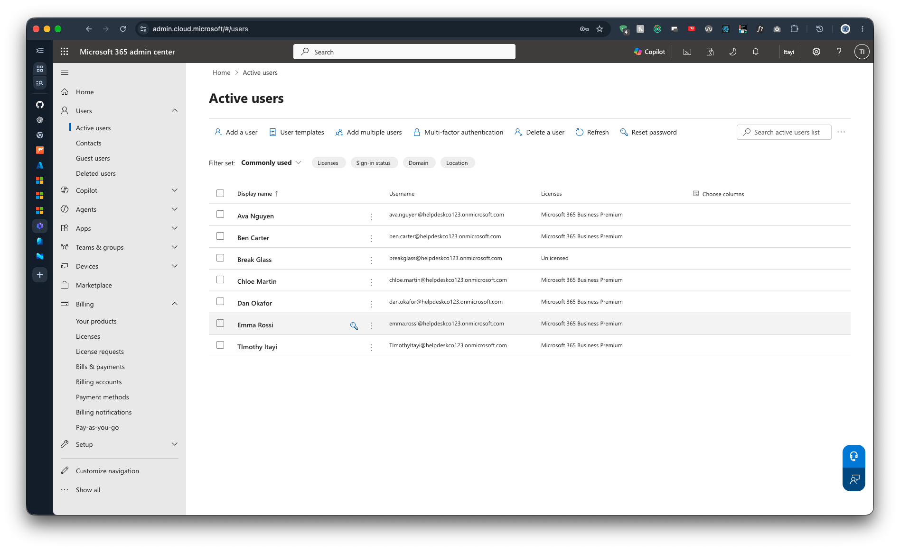
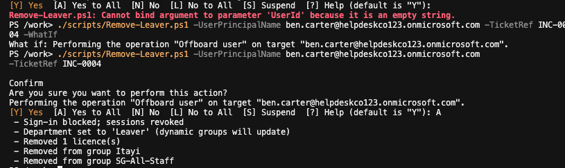
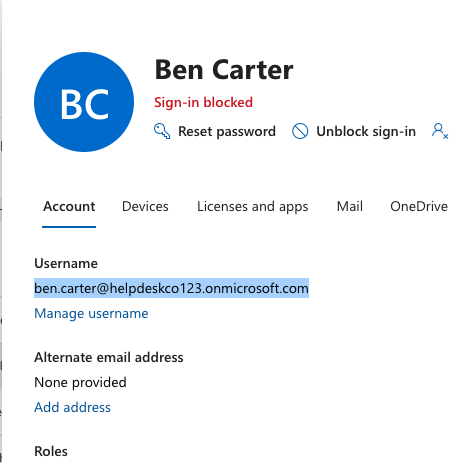
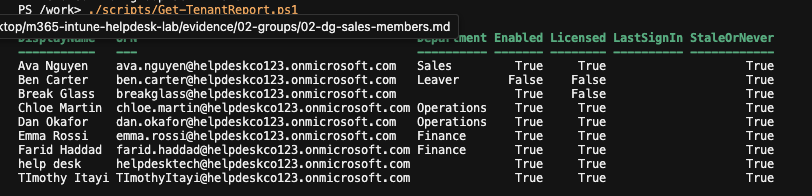

# Phase 3: PowerShell automation

Previous: [02-groups.md](02-groups.md)

Decisions: [05-scripts.md](../decisions/05-scripts.md)

Scripts: [scripts/README.md](../../scripts/README.md)

## Objective

Make joiner and leaver tasks fast, consistent and auditable.

## What I built

| Script | Purpose |
|---|---|
| New-Starter.ps1 | Creates a user, sets usage location, assigns a licence, logs the action |
| Remove-Leaver.ps1 | Blocks sign-in, revokes sessions, removes licence and assigned groups, sets the department to `Leaver`, logs the action |
| Get-TenantReport.ps1 | Lists users with licence and last sign-in, flags stale accounts |

## Design choices

- **`-WhatIf` support** so a change can be previewed before it happens.
- **Pre-checks** for existing users and free licences to fail early with a clear message.
- **Passwords are never written to the log**, only displayed once.
- **Runs in a Docker container** so anyone can reproduce it without installing modules.
- **Leavers change department to `Leaver`**, because dynamic groups cannot be edited by hand.
- **Least privilege for helpdesk:** the Helpdesk Administrator role, not Global Administrator.

## Results

- Connected to Microsoft Graph with device code sign-in as the admin.
- Created six users across three departments (two each in Sales, Operations and Finance). Dynamic groups filled from the department. I did not time how long it took.
- The Helpdesk Administrator role could reset Ava's password but could not create users.
- Ran the leaver process on Ben Carter. The script reported every step, the admin center showed his sign-in as blocked, and the tenant report showed him disabled, unlicensed and in department `Leaver`.
- A sign-in attempt as Ben in a private window gave "Your account or password is incorrect". That message is the same as a wrong password, so it does not prove the block by itself.

## Evidence

Step write-ups, in order:

1. [Connect to Microsoft Graph](../../evidence/03-scripts/00-connect-mggraph.md)
2. [Licence SKU](../../evidence/03-scripts/01-licence-sku.md)
3. [Dry run with -WhatIf](../../evidence/03-scripts/02-whatif-dry-run.md)
4. [Create the six users](../../evidence/03-scripts/03-create-users.md)
5. [Verify in the portals](../../evidence/03-scripts/04-verify-portals.md)
6. [Actions log](../../evidence/03-scripts/05-actions-log.md)
7. [Helpdesk role test](../../evidence/03-scripts/06-helpdesk-role-test.md)
8. [Leaver output](../../evidence/03-scripts/07-leaver-output.md)
9. [Ben is blocked](../../evidence/03-scripts/08-ben-blocked.md)
10. [Tenant report](../../evidence/03-scripts/09-tenant-report.md)

Key screenshots:

Other screenshots are in the step write-ups. Group membership evidence is in [Phase 2](02-groups.md).

## Issues and fixes

| Issue | Cause | Fix |
|---|---|---|
| Farid's starter was logged under `INC-000` instead of `INC-0001` | Typo in `-TicketRef`. The script accepts any text | None. The log is append-only, so the typo is recorded here. Validating the ticket format in the script would prevent it |
| `Remove-Leaver.ps1` failed once with "Cannot bind argument to parameter 'UserId' because it is an empty string" | Not established | Re-ran. The dry run and real run after it worked |
| Tenant report shows "never signed in" for accounts that have signed in | Not established. Graph sign-in activity may lag | Not fixed. Re-run the report later |
| A screenshot showed all six temporary passwords in plain text | Taken before the passwords were redacted | Moved to the gitignored `evidence-raw/` folder. The redacted version is used |

## Limits and what I'd do in production

- Removing a licence can lead to mailbox deletion after a retention period. In production I would
  first convert the mailbox to a shared mailbox or hand it to the manager.
- Real leavers also need device wipe/retire in Intune, account deprovisioning in other apps,
  and manager approval, not just the identity steps.
- Deliver temporary passwords through a secure channel or a Temporary Access Pass, not the terminal.
- Grant narrower Graph permissions, and use an app registration with certificate authentication instead of a delegated admin session with tenant-wide consent.
- Create the `logs/` folder in the script if it is missing, and write the log before creating the user, or print the password first.
- Add new starters to `SG-All-Staff` in the script instead of by hand.
- Log portal actions as well as script actions, so the helpdesk user and password resets show up in the action log.

## Not shown

- Ben's removal from `DG-Sales` after the leaver run.
- `DG-Finance` membership.
- Ben's failed sign-in in the Entra sign-in logs, which would show the actual failure reason.

## Checkpoint

You are connected to Graph, six users exist with licences, the dynamic groups filled from department, the leaver script blocked a user, and every script action is in the log.
