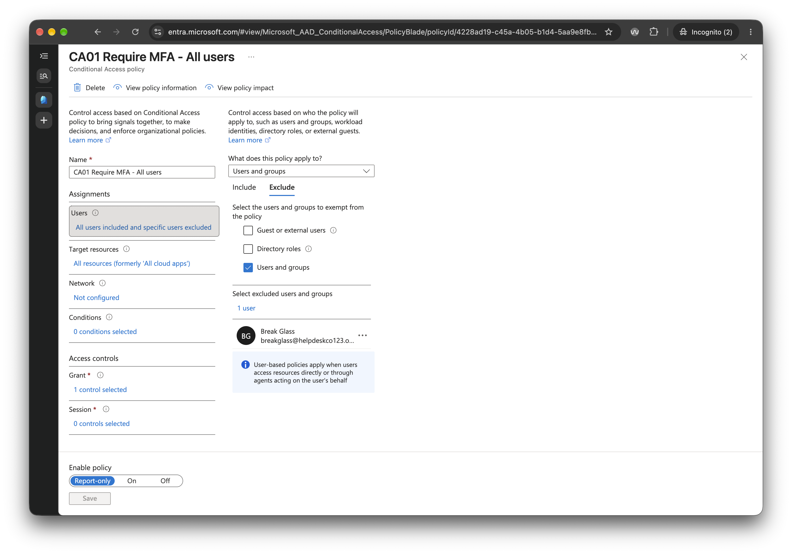
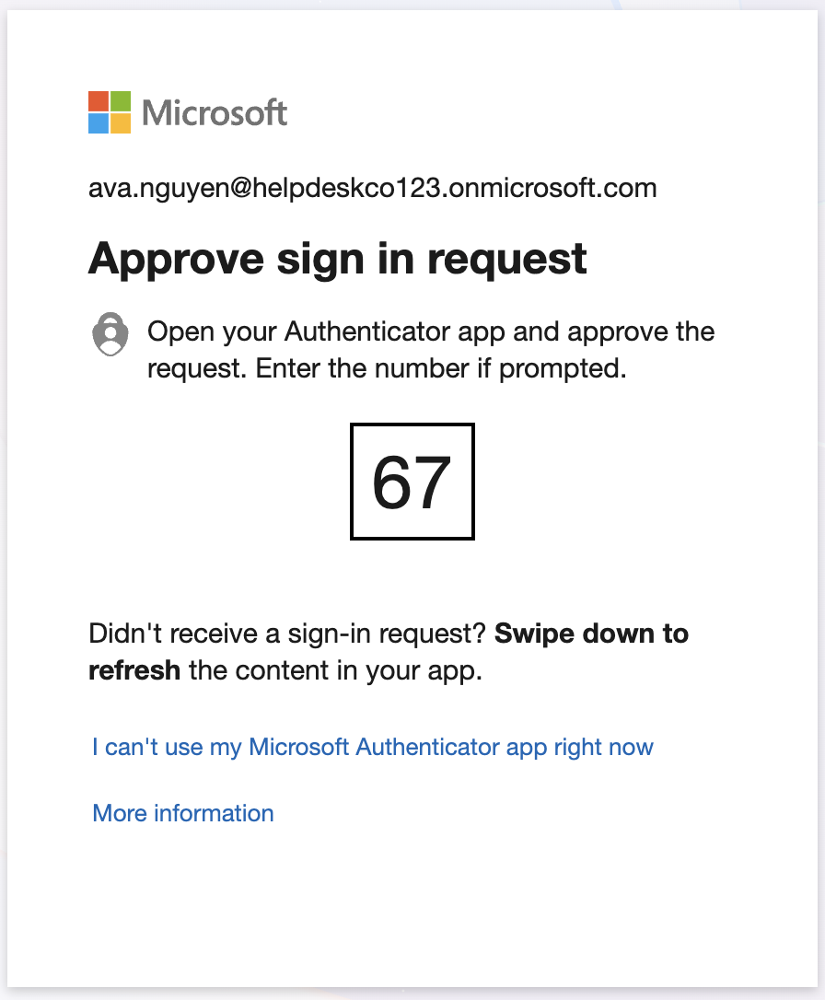

# Phase 4: MFA and Conditional Access

Previous: [03-scripts.md](03-scripts.md)

Decisions: [06-conditional-access.md](../decisions/06-conditional-access.md)

Status: In progress. Steps 4.1 to 4.3 have evidence, with gaps. Step 4.4 (enforce CA01 and CA02) has no evidence, and the last screenshot of the policy states shows all three in Report-only.

## Objective

Require MFA and block weak sign-in methods without locking anyone out, and prepare a device compliance policy. Phase 6 was skipped ([06-device.md](06-device.md)), so that policy was never enforced.

## Policies

| Policy | Applies to | Control | State (last shown) |
|---|---|---|---|
| CA01 Require MFA - All users | All users, excluding break-glass | Require multifactor authentication | Report-only |
| CA02 Block legacy authentication | All users, excluding break-glass | Block Exchange ActiveSync and other legacy clients | Report-only |
| CA03 Require compliant device - Office 365 | `SG-All-Staff`, excluding break-glass and the admin | Require a compliant device | Report-only, permanently (Phase 6 skipped) |

## Method

Every policy started in Report-only. Ava Nguyen, a standard user, then signed in from a private window and registered Microsoft Authenticator, and her sign-in was looked up in the Entra sign-in logs.

## Design choices

- **Security defaults off first.** Conditional Access replaces them, and the two cannot be used together.
- **Report-only for everything.** Nothing is enforced by the new policies until the sign-in logs show what each would have done.
- **Break-glass excluded.** This is the reason the account exists ([Phase 1](01-tenant.md)).
- **CA03 stays Report-only.** The plan was to wait for Phase 6, but that phase was skipped and no device is enrolled, so requiring compliance would lock out `SG-All-Staff`.

## Results

- Disabled security defaults and chose to replace them with Conditional Access ([00-security-defaults-off.md](../../evidence/04-conditional-access/00-security-defaults-off.md)).
- Created CA01, CA02 and CA03, all Report-only, at 11:26, 11:27 and 11:31 on 30/09/2026 ([02-policy-list-report-only.md](../../evidence/04-conditional-access/02-policy-list-report-only.md)).
- CA01 excludes the break-glass account ([01-ca01-settings.md](../../evidence/04-conditional-access/01-ca01-settings.md)).
- Ava was challenged for MFA with a number-matching prompt in Authenticator ([03-ava-mfa-prompt.md](../../evidence/04-conditional-access/03-ava-mfa-prompt.md)).
- Her sign-in log shows an MFA policy in the Enabled state applied, with the result Success and the grant control satisfied ([04-signin-log-ca-tab.md](../../evidence/04-conditional-access/04-signin-log-ca-tab.md)). The policy name in the pane, "Require multifactor authentication for all users", does not match CA01, so I can't say CA01 caused it.

## Evidence

1. [Security defaults off](../../evidence/04-conditional-access/00-security-defaults-off.md)
2. [CA01 settings](../../evidence/04-conditional-access/01-ca01-settings.md)
3. [Policy list, Report-only](../../evidence/04-conditional-access/02-policy-list-report-only.md)
4. [Ava's MFA prompt](../../evidence/04-conditional-access/03-ava-mfa-prompt.md)
5. [Sign-in log, policy details](../../evidence/04-conditional-access/04-signin-log-ca-tab.md)

- 
- 
- 
- 
- 

## What I observed

- The policy in Ava's sign-in log was Enabled, not Report-only. The tutorial expected CA01's Report-only result. Either an enforcing policy was already acting on her, or CA01 had been switched On. The screenshots don't say which.
- The tenant has four Microsoft-managed policies On, including MFA for all users. That makes them the most likely source of the prompt, but I haven't checked.
- The one thing the screenshots do show is that Ava, as a normal user, is asked for MFA and can satisfy it.

## Risks I'm managing

- The break-glass account is excluded from CA01. CA02 and CA03 exclusions are not shown.
- The admin is not excluded from CA01, so switching CA01 to On depends on the admin's MFA being registered. The tutorial's "admin excluded until MFA is confirmed" is not what CA01 shows.
- I don't know whether the Microsoft-managed policies exclude the break-glass account.
- Screenshot [ava-ca-policy-details.png](../../evidence/04-conditional-access/images/ava-ca-policy-details.png) shows Ava's IP address (IPv6) and suburb. If the repo is ever public, blur that region first.

## Issues and open questions

| Issue | Cause | Status |
|---|---|---|
| Ava's sign-in log shows an Enabled policy named "Require multifactor authentication for all users", not CA01 | Not established. Likely a Microsoft-managed policy | Open the full Conditional Access tab for Ava's sign-in and screenshot every policy listed |
| No Report-only result for CA01 was captured | The pane screenshotted was a different policy | Open the sign-in log entry and look for CA01 |
| Four Microsoft-managed policies are On, including MFA for all users and MFA for admins | Microsoft creates them in new tenants | Not opened. Check their exclusions before relying on break-glass |
| Security defaults screenshot shows the panel before Save | Screenshot taken before saving | Saved state inferred from the policies being created afterwards |
| CA01's Grant control is not shown, only "1 control selected" | Grant panel not open | Open the policy and screenshot Grant |
| CA02 and CA03 settings are not shown, only their names and state | Only the list was captured | Not verified |
| Ava's screenshot reveals her IP address and suburb | Sign-in log detail includes network info | Not redacted |

## Not done, or not shown

- Ava's first sign-in, password change and Authenticator registration screens.
- The What If result for Ava and Office 365 (4.3).
- Enforcing CA01 and CA02, and signing in again to confirm the prompt (4.4). The policy list still shows Report-only, and nothing later shows a change.
- MFA registration for the admin, which 4.4 requires first.
- No lockout occurred, so there is no Phase 7 incident from this phase.

## What I'd do in production

- Alert whenever the break-glass account signs in.
- Use named locations and risk-based policies. Risk-based policies need Entra ID P2, and I have not checked whether this tenant has it.

## Checkpoint

Security defaults are off and three policies exist in Report-only. Ava has Authenticator and was challenged for MFA, but by a policy that may not be CA01. CA01 and CA02 are not shown enforced, so the tutorial's checkpoint (CA01 and CA02 On, evidence 01 to 05) is not met yet.
