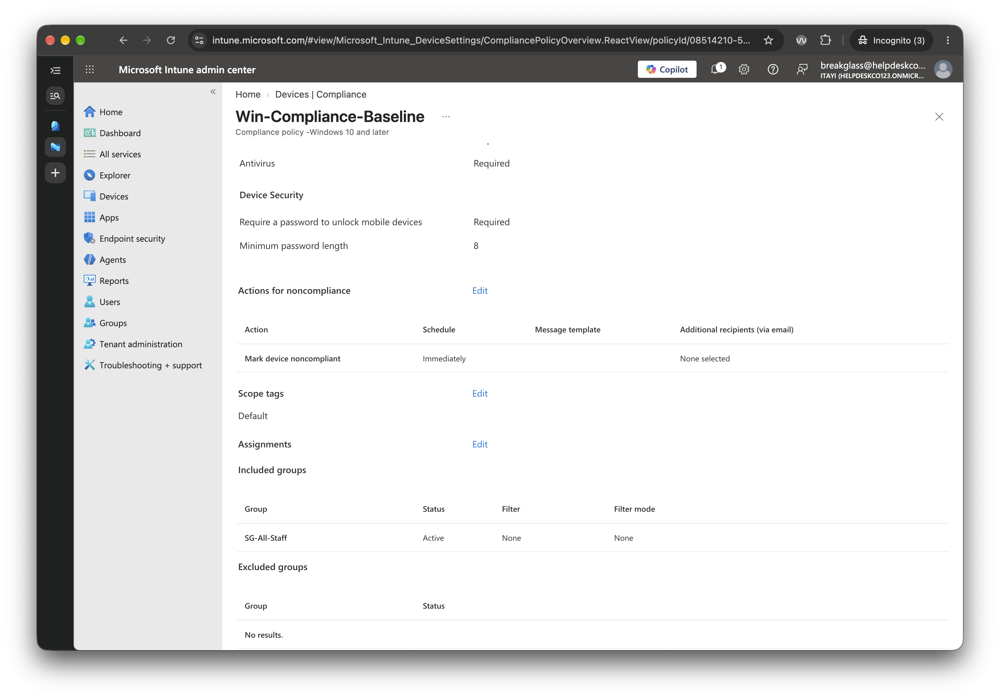
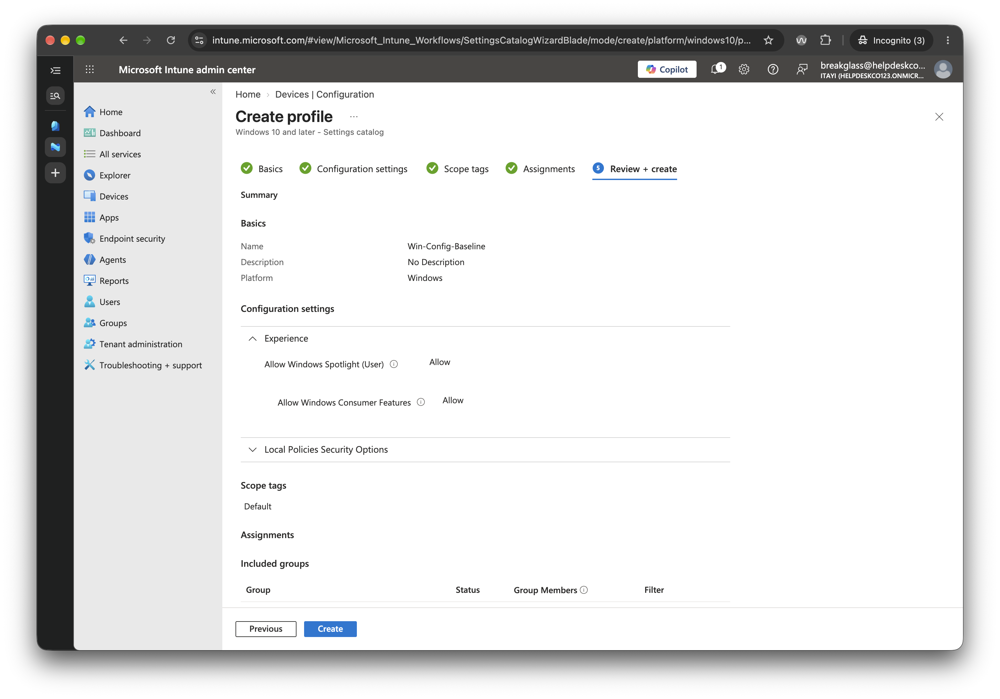
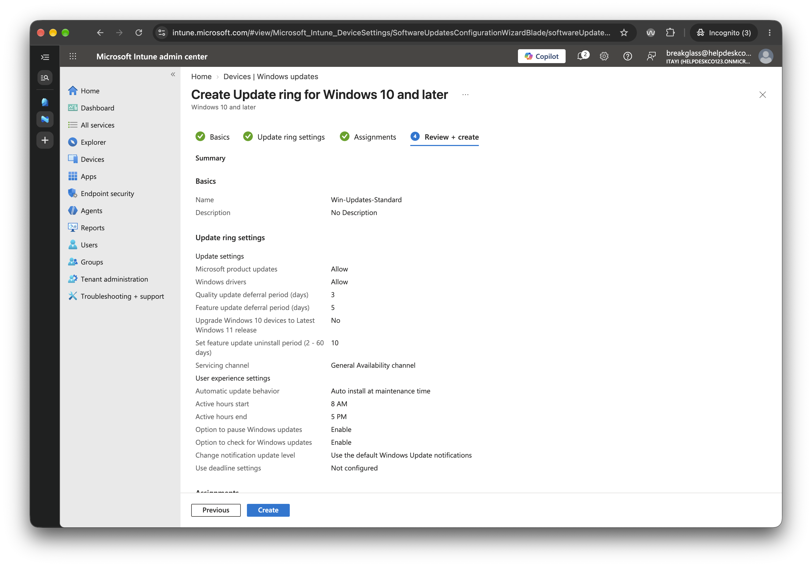

# Phase 5: Intune policies

Previous: [04-conditional-access.md](04-conditional-access.md)

Decisions: [07-intune.md](../decisions/07-intune.md)

Status: Configured, with gaps. The policies were built and assigned to `SG-All-Staff`. The update ring and app are shown only on their Review + create pages, and three settings don't match the plan.

## Objective

Define a baseline for company Windows devices.

## Policies

| Policy | Type | Key settings (as shown in evidence) | Assigned to (as shown) |
|---|---|---|---|
| Win-Compliance-Baseline | Compliance | Antivirus, password required, minimum length 8, 1-minute inactivity, 41-day expiry. BitLocker, Secure Boot and firewall not visible | SG-All-Staff |
| Win-Config-Baseline | Settings catalog | 900-second inactivity limit. Consumer features **Allow**, Spotlight Allow | Not shown (empty on the review page) |
| Win-Updates-Standard | Update ring | 3-day quality deferral, 5-day feature deferral, no deadline set | Not shown |
| Windows Terminal | App | Required, install behaviour User | SG-All-Staff |

The intended settings were BitLocker, Secure Boot, a password of 8+ characters, firewall and antivirus; a 15-minute inactivity lock and consumer features off; a 3-day quality deferral and a 5-day deadline.

## Why these settings

- **Compliance baseline:** disk encryption, boot integrity, a password, a firewall and antivirus are the minimum for a company laptop, and a device that lacks them is marked noncompliant straight away.
- **Inactivity lock:** an unattended, unlocked machine is an easy target. 900 seconds is 15 minutes.
- **Consumer features off:** stops Windows installing and suggesting consumer apps on a work device.
- **Update ring:** deferring quality updates a few days lets a bad update show up elsewhere before it reaches staff, and a deadline forces the install.
- **Windows Terminal:** a small, free app that proves app deployment works.

These are the reasons for the settings. Some of these settings are not confirmed in the screenshots, as listed below.

## Evidence

1. [MDM user scope](../../evidence/05-intune/00-mdm-user-scope.md)
2. [Compliance policy](../../evidence/05-intune/01-compliance-policy.md)
3. [Configuration profile](../../evidence/05-intune/02-config-profile.md)
4. [Update ring](../../evidence/05-intune/03-update-ring.md)
5. [App assignment](../../evidence/05-intune/04-app-assignment.md)

- 
- 
- 
- 
- 

## Results

- MDM user scope shows All. It is taken as saved, because the setup carried on from there ([00-mdm-user-scope.md](../../evidence/05-intune/00-mdm-user-scope.md)).
- The compliance policy is saved and assigned to `SG-All-Staff`, with "Mark device noncompliant, immediately" as its action.
- The config profile is a saved object: its settings page shows the 900-second inactivity limit and consumer features set to Allow ([02-config-profile.md](../../evidence/05-intune/02-config-profile.md)).
- The update ring and app are shown only on their Review + create pages. They were created straight after, but no screenshot shows the saved objects.
- The app is Required for `SG-All-Staff`.

## Issues and open questions

| Issue | Cause | Status |
|---|---|---|
| Config profile shows Allow Windows Consumer Features = Allow | Setting not turned off, or the wrong value picked | Open. Fix the setting, or note that it was left on |
| Config profile shows no group in Included groups | Assignment not captured, or not set | Open. Check Properties > Assignments on the created profile |
| Update ring: 5 days is the feature update deferral, deadline settings are Not configured | Plan asked for a deadline | Open. Set a deadline or change the plan |
| Update ring assignment not shown | Review page has no visible assignment | Open |
| Compliance policy: BitLocker, Secure Boot and Firewall not visible | Device Health is collapsed in the settings screenshot | Open. Expand Device Health and the firewall setting |
| Compliance policy settings page shows a 1-minute inactivity limit and 41-day expiry | Not in the tutorial. Chosen or default, unknown | Open |
| Update ring and app shown only on Review + create pages | Screenshots taken before Create | Created straight after, not shown as saved objects |
## Risks I'm managing

- **Break-glass account in use.** The screenshots show `breakglass@helpdeskco…` signed in. Reason: the break-glass account is used to read the Entra sign-in logs while checking the Conditional Access results in [Phase 4](04-conditional-access.md), and the Intune pages were captured in the same session. The account has no MFA policy of its own, so its sign-ins should still be watched.
- MDM scope All means every user can enrol, not only staff in `SG-All-Staff`.

## Not yet tested

Policies were created but never verified on a device. [Phase 6](06-device.md) was skipped because there is no Windows machine, so no device is enrolled and none of these policies has been applied or evaluated.

## Checkpoint

The tutorial's checkpoint is "four assignments visible in Intune". Two are shown as assigned (the compliance policy and the app), and only one of those, the compliance policy, is a saved object. The config profile's assignment is not shown (empty on the review page), and the update ring's assignment is not shown. The checkpoint is not met by the evidence yet.
