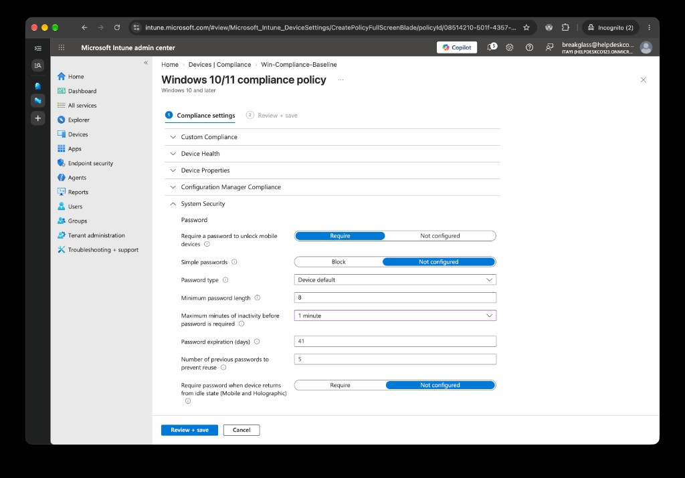

# Phase 5: Intune policies

Previous: [04-conditional-access.md](04-conditional-access.md)

Decisions: [07-intune.md](../decisions/07-intune.md)

## Objective

Define a configuration baseline for company Windows devices, targeted at `SG-All-Staff`.

## Policies

| Policy | Type | Key settings | Target group |
|---|---|---|---|
| MDM user scope | Automatic enrolment | Scope set to All | All users |
| Win-Compliance-Baseline | Compliance | Antivirus required, password required with a minimum length of 8, noncompliant devices marked immediately | SG-All-Staff |
| Win-Config-Baseline | Settings catalog | 900-second machine inactivity limit, Windows Spotlight and consumer features settings | SG-All-Staff |
| Win-Updates-Standard | Update ring | 3-day quality update deferral, 5-day feature update deferral, General Availability channel, auto install at maintenance time | SG-All-Staff |
| Windows Terminal | Microsoft Store app | Required, installs for the user | SG-All-Staff |

## Why these settings

- **MDM user scope All:** devices that join Entra ID show up in Intune automatically, which is the usual fix for "why isn't my device showing?".
- **Compliance baseline:** a password and antivirus are the minimum for a company laptop, and a device without them is marked noncompliant straight away.
- **Inactivity limit:** an unattended, unlocked machine is an easy target. 900 seconds is 15 minutes.
- **Update ring:** deferring quality updates a few days lets a bad update show up elsewhere before it reaches staff.
- **Windows Terminal:** a small, free app that shows how app assignment works.

## Evidence

1. [MDM user scope](../../evidence/05-intune/00-mdm-user-scope.md)
2. [Compliance policy](../../evidence/05-intune/01-compliance-policy.md)
3. [Configuration profile](../../evidence/05-intune/02-config-profile.md)
4. [Update ring](../../evidence/05-intune/03-update-ring.md)
5. [App assignment](../../evidence/05-intune/04-app-assignment.md)

- 
- 
- 
- 
- 
- 

## Results

- MDM user scope set to All.
- The compliance policy is saved and targets `SG-All-Staff`, with "Mark device noncompliant, immediately" as its action.
- The configuration profile sets a 900-second machine inactivity limit.
- The update ring sets a 3-day quality deferral and a 5-day feature update deferral.
- Windows Terminal is assigned as Required for `SG-All-Staff`.

## What I'd do in production

- Pilot policies on a small group before targeting all staff.
- Add BitLocker, Secure Boot and firewall requirements to the compliance baseline.
- Set an update deadline as well as deferrals.

## Checkpoint

The MDM scope, a compliance policy, a configuration profile, an update ring and an app assignment are configured in Intune for `SG-All-Staff`.
