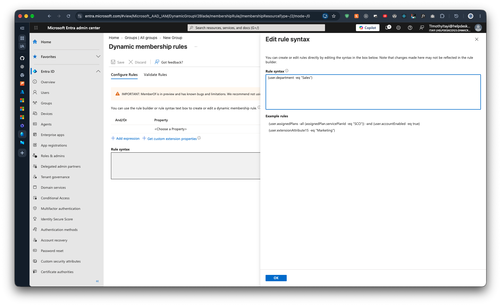
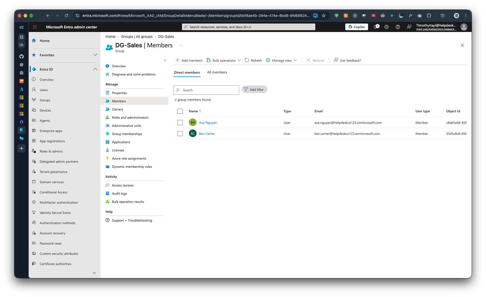

# Runbook: A new starter is missing from their department group

Previous: [licence-assignment-failure.md](licence-assignment-failure.md)

**Applies to:** Users in `DG-Sales`, `DG-Operations` and `DG-Finance`  |  **Status:** Written from how the lab's groups behaved, not from an incident  |  **Last run:** Never. The typo case was not reproduced

## Symptoms

A user is missing from their department group, so they're missing what that group gives them.

## Checks (in order)

1. Open the user's properties in Entra and read the **Department** value.
2. Compare it with the group's rule. The lab's rules match the department text exactly, for example `(user.department -eq "Sales")` ([00-dg-sales-rule.md](../../evidence/02-groups/00-dg-sales-rule.md)).

   

3. Look for a typo, extra space or wrong department. `-eq` is an exact comparison, so a near miss doesn't match.
4. If the department is correct, wait a few minutes. Dynamic membership doesn't update instantly.

## Fix

1. Correct the Department on the user. You can't add a user to a dynamic group by hand.
2. Wait a few minutes and re-check the group's members.

The leaver run is the lab's proof that a department change moves a user between groups. Setting Ben's department to `Leaver` removed him from `DG-Sales` ([07-leaver-output.md](../../evidence/03-scripts/07-leaver-output.md)).

## Verify it worked

The user appears in the group's member list:

## Escalate when

- The department is correct, several minutes have passed and the user still isn't in the group.
- The user needs access without changing the department. Use an assigned group such as `SG-All-Staff` instead ([04-sg-all-staff-members.md](../../evidence/02-groups/04-sg-all-staff-members.md)).

## Related tickets

None.
