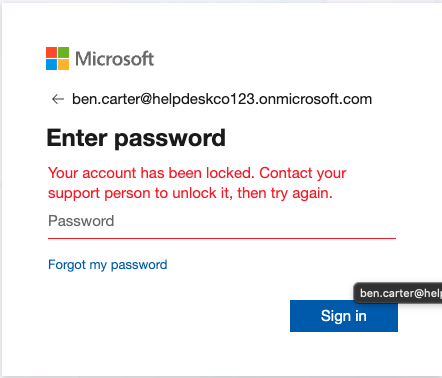
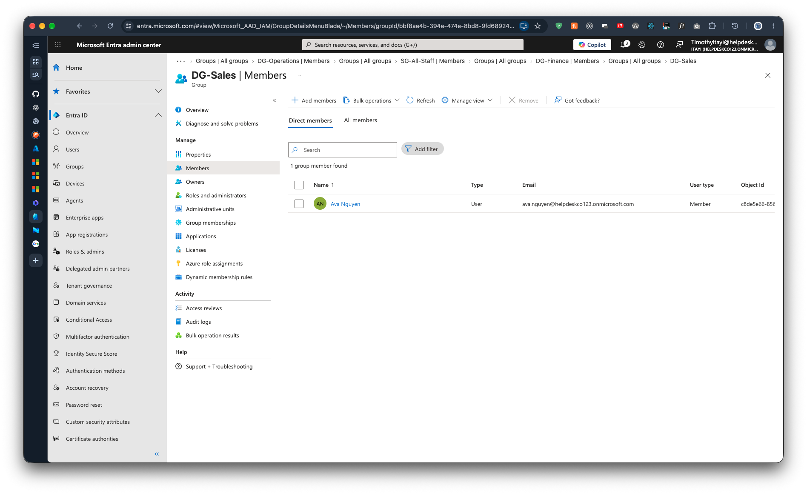

# Runbook: Offboard a leaver

Previous: [new-starter.md](new-starter.md)

**Applies to:** Standard users  |  **Based on:** the lab's steps, run for Ben Carter on 2026-09-29 ([07-leaver-output.md](../../evidence/03-scripts/07-leaver-output.md))

## Symptoms

A member of staff has left, and their access must end today.

## Checks (in order)

1. Confirm the leaver request has a ticket reference and comes from the manager or HR.
2. Connect to Graph as the admin, not the break-glass account ([scripts/README.md](../../scripts/README.md)).
3. Confirm the account exists, and note which groups and licences it has. The script removes the user from every assigned group, including Microsoft 365 groups, so check that none should be kept.

## Fix

1. Dry run. It prints one line for the whole offboarding, not the steps:

   ```powershell
   ./scripts/Remove-Leaver.ps1 -UserPrincipalName ben.carter@helpdeskco123.onmicrosoft.com -TicketRef INC-0004 -WhatIf
   ```

2. Run it without `-WhatIf` and confirm the prompt. It:
   1. blocks sign-in and revokes sessions,
   2. sets the department to `Leaver`, so the dynamic groups drop the user,
   3. removes all licences,
   4. removes the user from every assigned group.


## Verify it worked

- Microsoft 365 admin center shows **Sign-in blocked** for the user:

  

- A sign-in attempt fails with "Your account has been locked":

  

- After a few minutes the user is gone from the dynamic group, for example `DG-Sales`:

  

- `logs/actions.csv` has a `Leaver` row.

## Escalate when

- The user is a privileged account or a group owner.
- The user has devices, a mailbox or data that need handing over. These are handled outside this script, for example retiring devices in Intune and converting the mailbox to a shared mailbox.
- The request doesn't come from the manager or HR.

## Notes

- Dynamic group removal takes minutes, not seconds.

## Related tickets

INC-0004, the Phase 3 leaver run.
