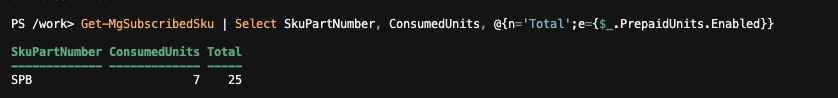

# Runbook: A new starter's licence can't be assigned

Previous: [password-reset.md](password-reset.md)

**Applies to:** New users  |  **Based on:** the pre-checks in `New-Starter.ps1` and the lab's licence evidence

## Symptoms

The user exists, but has no licence. `New-Starter.ps1` stops with one of these messages, or the portal refuses the assignment:

- `Licence SKU '<name>' not found in this tenant.`
- `No free '<name>' licences left.`

The script also sets a usage location (default `AU`) before assigning the licence, which is a Microsoft 365 requirement. A user created in the portal without a usage location can't be licensed.

## Checks (in order)

1. Connect to Graph as the admin ([scripts/README.md](../../scripts/README.md)).
2. List the SKUs and check the name and the free count:

   ```powershell
   Get-MgSubscribedSku | Select SkuPartNumber, ConsumedUnits, @{n='Total';e={$_.PrepaidUnits.Enabled}}
   ```

   The lab showed `SPB` with 7 consumed of 25 ([01-licence-sku.md](../../evidence/03-scripts/01-licence-sku.md)).

   

3. If the SKU name differs from the script default, pass it with `-LicenseSku`.
4. Check the user's usage location in the admin center or Entra. If it's empty, that's the cause.

## Fix

- **Wrong SKU name:** re-run with `-LicenseSku <name>`.
- **No free licences:** free one by removing it from a leaver ([leaver.md](leaver.md)), or buy more. Check the cost first.
- **Empty usage location:** set it (for example `AU`) on the user, then assign the licence in the admin center.

## Verify it worked

The user shows as licensed in the Microsoft 365 admin center, and the consumed count on the SKU goes up by one.

## Escalate when

- Licences are free, the usage location is set and the assignment still fails. Read the exact error text and escalate with it.

## Related

[new-starter.md](new-starter.md)
