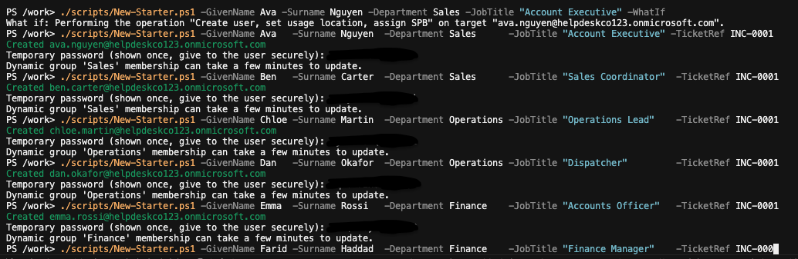

# Runbook: Create a new starter

Previous: [mfa-re-registration.md](mfa-re-registration.md)

**Applies to:** New staff in Sales, Operations or Finance  |  **Based on:** the lab's steps, run for six starters on 2026-09-29 ([03-create-users.md](../../evidence/03-scripts/03-create-users.md))

## Symptoms

A new member of staff needs an account, a licence and the right groups before their first day.

## Checks (in order)

1. Confirm the request has a ticket reference and the details: given name, surname, department (`Sales`, `Operations` or `Finance`) and job title.
2. Open the lab container and connect to Graph as the admin, not the break-glass account ([scripts/README.md](../../scripts/README.md)).
3. Make sure `logs/` exists (`mkdir -p logs`). If it doesn't, the user is created and then the log write fails.
4. Check a free licence exists:

   ```powershell
   Get-MgSubscribedSku | Select SkuPartNumber, ConsumedUnits, @{n='Total';e={$_.PrepaidUnits.Enabled}}
   ```

   See [01-licence-sku.md](../../evidence/03-scripts/01-licence-sku.md).

## Fix

1. Dry run:

   ```powershell
   ./scripts/New-Starter.ps1 -GivenName Ava -Surname Nguyen -Department Sales -JobTitle "Account Executive" -TicketRef INC-0001 -WhatIf
   ```

2. Run it again without `-WhatIf`. Copy the temporary password shown on screen. It is shown once and not logged.
3. Give the password to the user through a secure channel. They must change it at first sign-in.
4. Add the user to `SG-All-Staff` by hand. The script does not.



## Verify it worked

- The user appears in the Microsoft 365 admin center with a licence ([04-verify-portals.md](../../evidence/03-scripts/04-verify-portals.md)).
- After a few minutes the user appears in the department's dynamic group, for example `DG-Sales` ([02-dg-sales-members.md](../../evidence/02-groups/02-dg-sales-members.md)).
- `logs/actions.csv` has a `Starter` row ([05-actions-log.md](../../evidence/03-scripts/05-actions-log.md)).

## Escalate when

- The script says the SKU is missing or no licences are free. See [licence-assignment-failure.md](licence-assignment-failure.md).
- The user already exists. Don't create a second account.

## Notes

- `-TicketRef` is free text and the log is append-only, so check the reference before pressing Enter.

## Related

[scripts/README.md](../../scripts/README.md)
