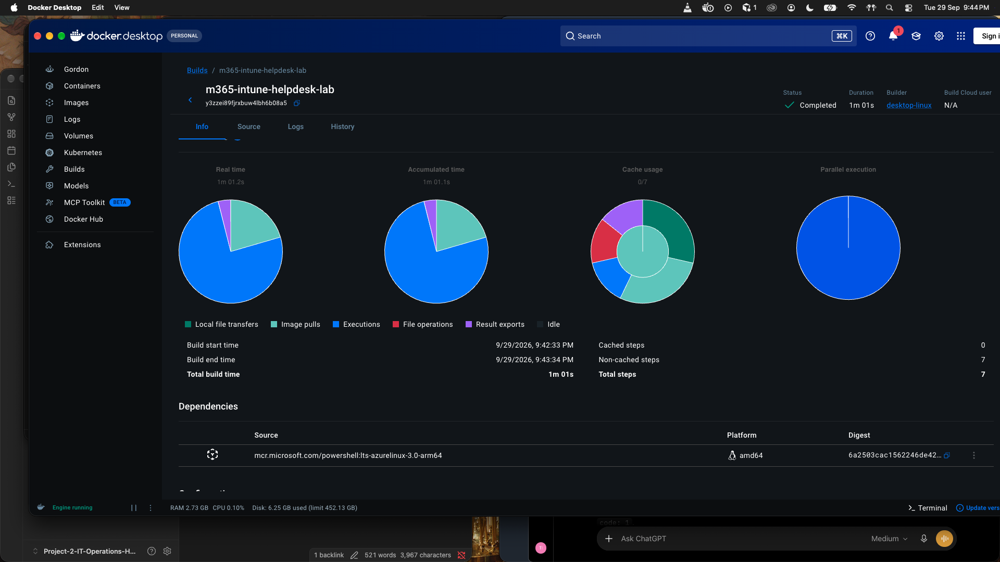
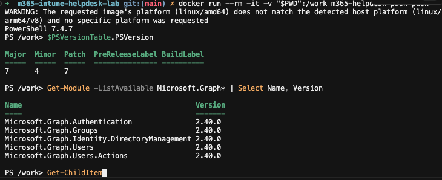

# PowerShell Docker Image Setup

Previous: [00.md](00.md) (osTicket Lab Setup)

This image gives the lab a containerised PowerShell environment with the Microsoft Graph modules installed. It is used for the Microsoft 365 / Intune admin scripts.

## Stack

- Docker Desktop on macOS (Apple Silicon)
- Base image: `mcr.microsoft.com/powershell:lts-azurelinux-3.0-arm64`
- PowerShell modules from PSGallery:
  - `Microsoft.Graph.Authentication`
  - `Microsoft.Graph.Users`
  - `Microsoft.Graph.Users.Actions`
  - `Microsoft.Graph.Groups`
  - `Microsoft.Graph.Identity.DirectoryManagement`

## Dockerfile

```dockerfile
FROM mcr.microsoft.com/powershell:lts-azurelinux-3.0-arm64

RUN pwsh -NoProfile -Command \
    '$ErrorActionPreference = "Stop"; \
     Set-PSRepository -Name PSGallery -InstallationPolicy Trusted; \
     $modules = @( \
       "Microsoft.Graph.Authentication", \
       "Microsoft.Graph.Users", \
       "Microsoft.Graph.Users.Actions", \
       "Microsoft.Graph.Groups", \
       "Microsoft.Graph.Identity.DirectoryManagement" \
     ); \
     foreach ($module in $modules) { \
       Write-Host "Installing $module"; \
       Install-Module $module -Scope AllUsers -Repository PSGallery -Force \
     }'

WORKDIR /work
```

- `$ErrorActionPreference = "Stop"` makes the build fail on the first module error instead of producing a half-installed image.
- `-Scope AllUsers` installs the modules system-wide inside the image.
- `WORKDIR /work` is where the lab scripts are expected to be mounted or copied.

## Build

```bash
docker build --progress=plain -t m365-helpdesk-pwsh .
```

## What Went Wrong First

The first attempts used `mcr.microsoft.com/powershell:latest` with `--platform=linux/amd64`. The build crashed with exit code 133 during the `Install-Module` step:

```text
assertion failed [block != nullptr]: BasicBlock requested for unrecognized address
Trace/breakpoint trap
```

`powershell:latest` has no `linux/arm64` image, so the amd64 image ran under emulation on the M-series Mac and the .NET runtime crashed.

Switching to the native arm64 tag `lts-azurelinux-3.0-arm64` fixed the crash and the build completed. The image's platform label is still wrong, though. See [Open Item](#open-item-image-platform-label-says-amd64).

- Incident report: [Docker build failure on Apple Silicon](../../docs/incidents/01-setup.md#incident-docker-build-failure-on-apple-silicon)
- Decision record: [02-setup.md](../../docs/decisions/02-setup.md)

## Evidence

Docker Desktop build dashboard for the successful build:



| Item | Value |
| --- | --- |
| Status | Completed |
| Builder | `desktop-linux` |
| Started | 9/29/2026, 9:42:33 PM |
| Finished | 9/29/2026, 9:43:34 PM |
| Duration | 1m 01s |
| Steps | 7, none cached |
| Base image | `mcr.microsoft.com/powershell:lts-azurelinux-3.0-arm64` |

Almost all of the build time was spent on the `Install-Module` execution step, which is expected because it downloads the Graph modules from PSGallery.

## Verification

### One-shot check

```bash
docker run --rm -v "$PWD":/work m365-helpdesk-pwsh pwsh -NoProfile -Command '
$PSVersionTable.PSVersion
[System.Runtime.InteropServices.RuntimeInformation]::OSArchitecture
[System.Runtime.InteropServices.RuntimeInformation]::ProcessArchitecture
Get-Module -ListAvailable Microsoft.Graph* | Select-Object Name, Version | Sort-Object Name
Get-ChildItem /work
'
```

The whole script is single-quoted so zsh does not expand `$PSVersionTable`. The repo is mounted at `/work` so `Get-ChildItem` has something to list.


| Check | Result |
| --- | --- |
| PowerShell version | 7.4.7 |
| `OSArchitecture` | `Arm64` |
| `ProcessArchitecture` | `Arm64` |
| Graph modules | `Authentication`, `Groups`, `Identity.DirectoryManagement`, `Users`, `Users.Actions`, all `2.40.0` |
| `/work` mount | Repo contents visible (`docs`, `evidence`, `evidence-raw`, `logs`, `scripts`, `tickets`, `Dockerfile`, `README.md`) |

### Interactive shell

```bash
docker run --rm -it -v "$PWD":/work m365-helpdesk-pwsh pwsh
```

Inside the shell, `$PSVersionTable.PSVersion` and `Get-Module -ListAvailable Microsoft.Graph* | Select Name, Version` return the same version and module list as the one-shot check. The `Get-ChildItem` in this session was cancelled with Ctrl+C, so the mount check comes from the one-shot run above.



### Host-side image inspect

```bash
docker image inspect m365-helpdesk-pwsh --format '{{.Os}}/{{.Architecture}}'
```

Output:

```text
linux/amd64
```

This is not the result I expected. See the open item below.

## Open Item: Image Platform Label Says `amd64`

Every Docker-level check reports `amd64`, while PowerShell inside the container reports `Arm64`.

| Source | Reports |
| --- | --- |
| MCR registry, image config for `lts-azurelinux-3.0-arm64` | `arm64` |
| Docker Desktop build dashboard, Dependencies | `amd64` |
| `docker image inspect m365-helpdesk-pwsh` | `linux/amd64` |
| `docker run` warning | image `linux/amd64` vs host `linux/arm64/v8` |
| `OSArchitecture` inside the container | `Arm64` |
| `ProcessArchitecture` inside the container | `Arm64` |

**What this means:** `ProcessArchitecture` is the architecture of the `pwsh` binary itself. Under x86 emulation it would report `X64`. It reports `Arm64`, so the PowerShell binary is native arm64 and the container is not being emulated. The base image contents are correct. What is wrong is the platform label on the locally built image.

**Likely cause (not verified):** the build was run with `--platform=linux/amd64` still set, or with an amd64 default platform. The base tag is a single-architecture arm64 image, so BuildKit accepts it, but it labels the resulting image `amd64`. I don't have the exact build command from that run, so I can't confirm this.

**Why it matters:**

- Docker prints the platform mismatch warning on every `docker run`.
- The image claims to be amd64 while containing arm64 binaries. Pushing it or running it on an actual x86 host would fail in confusing ways.

**To fix and confirm:** rebuild with the platform stated explicitly, then inspect again.

```bash
docker build --no-cache --platform=linux/arm64 --progress=plain -t m365-helpdesk-pwsh .
docker image inspect m365-helpdesk-pwsh --format '{{.Os}}/{{.Architecture}}'
```

Expected: `linux/arm64`, and no platform warning on `docker run`. Record the actual output here once it has been run.
