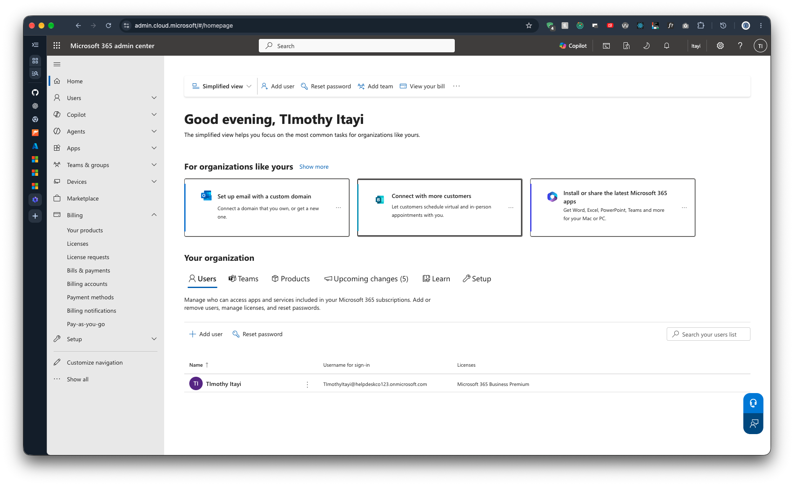

# 1.4 Secure the First Admin

Previous: [01.md](../00-setup/01.md) (PowerShell Docker image)

Decision: [03-tenant.md](../../docs/decisions/03-tenant.md)

## Steps

1. Sign in to <https://mysignins.microsoft.com/security-info> with the account used to sign up for the tenant.
2. Add Microsoft Authenticator (or another method) so the admin account has MFA.

## Evidence

Microsoft 365 admin center home page, showing the tenant and the first admin account.

| Item | Value |
| --- | --- |
| Tenant | `helpdeskco123.onmicrosoft.com` |
| Admin account | `TimothyItayi@helpdeskco123.onmicrosoft.com` |
| Licence | Microsoft 365 Business Premium |
| Users in tenant | 1 |
