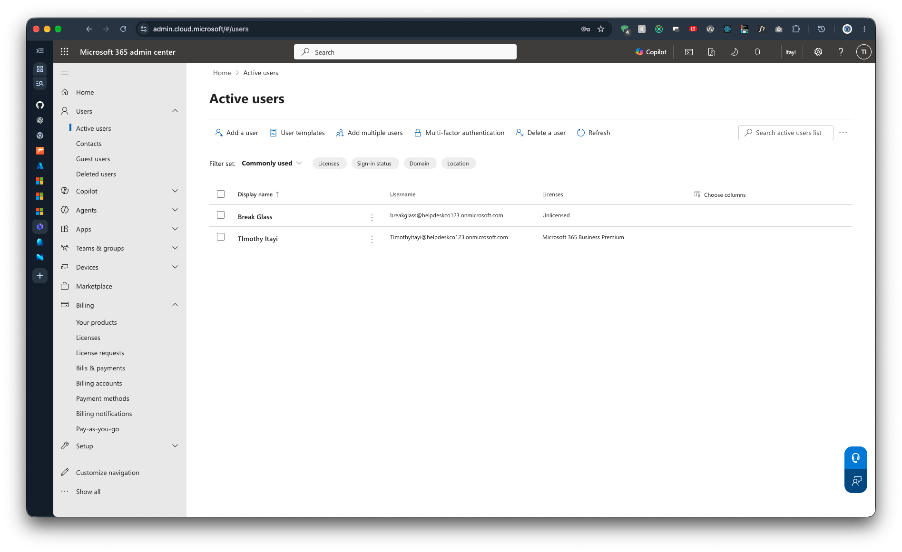

# 1.5 Create a Break-Glass Account

Previous: [00-Secure-first-admin.md](00-Secure-first-admin.md)

Decision: [03-tenant.md](../../docs/decisions/03-tenant.md)

A break-glass account is an emergency admin used if a Conditional Access policy locks everyone out. Real companies have at least one.

## Steps

In the Microsoft 365 admin center, go to Users > Active users > Add a user.

- Display name: `Break Glass`
- Username: `breakglass`
- Password: a long random one, stored in a password manager. Never in the repo.
- Turn off "Require this user to change their password".
- Assign role: Global Administrator.
- Do not assign a product licence.

## Evidence

Active users page showing the new account next to the first admin.

| Display name | Username | Licence |
| --- | --- | --- |
| Break Glass | `breakglass@helpdeskco123.onmicrosoft.com` | Unlicensed |
| Timothy Itayi | `TimothyItayi@helpdeskco123.onmicrosoft.com` | Microsoft 365 Business Premium |

The account exists and is unlicensed.
