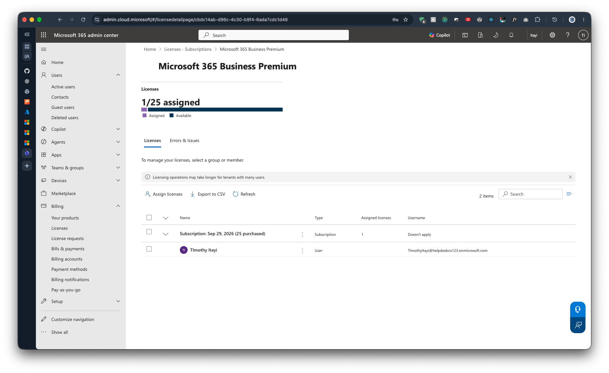

# 1.6 Check Licences

Previous: [01-break-glass-account.md](01-break-glass-account.md)

## Steps

In the Microsoft 365 admin center, go to Billing > Licenses.

Expected: a row for Microsoft 365 Business Premium with a number of available licences (up to 25 on the trial).

## Evidence

Licence details for Microsoft 365 Business Premium.

| Item | Value |
| --- | --- |
| Product | Microsoft 365 Business Premium (trial) |
| Licences purchased | 25 |
| Licences assigned | 1 (Timothy Itayi) |
| Licences available | 24 |
