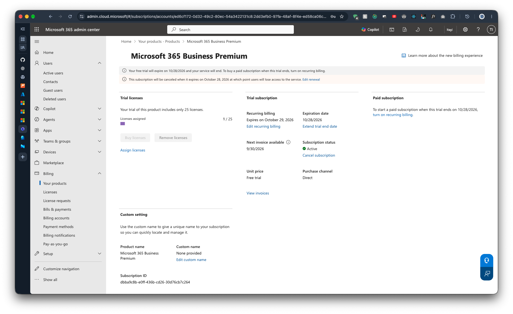

# 1.7 Recurring Billing Off

Previous: [02-check-licences.md](02-check-licences.md)

## Steps

In the Microsoft 365 admin center, go to Billing > Your products > Microsoft 365 Business Premium and confirm recurring billing is off, so the trial cannot turn into a paid subscription.

## Evidence

Trial subscription page.

| Item | Value |
| --- | --- |
| Subscription | Microsoft 365 Business Premium (free trial), Active |
| Licences assigned | 1 / 25 |
| Trial expires | 10/28/2026 |
| Recurring billing | Off. The page offers "turn on recurring billing", and says the subscription will be cancelled when it expires. |
