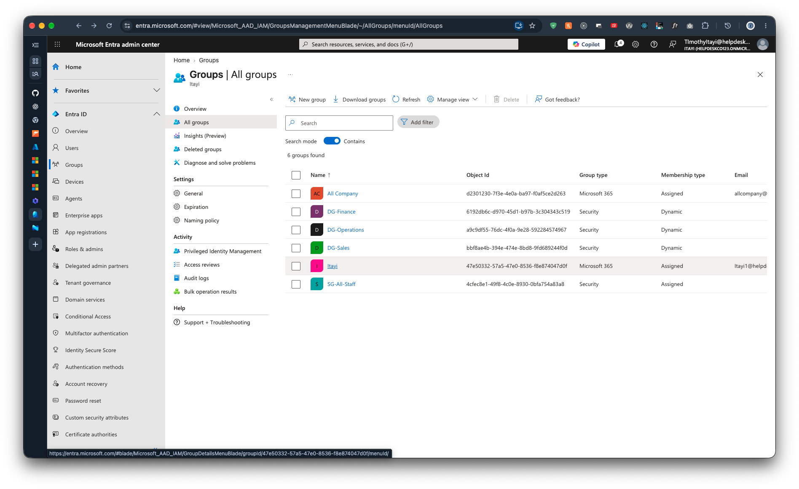

# 2.2 Groups List

Previous: [00-dg-sales-rule.md](00-dg-sales-rule.md)

Decision: [04-groups.md](../../docs/decisions/04-groups.md)

## Steps

In the Entra admin center, go to Groups > All groups and confirm the four groups exist with the right types.

## Evidence

The list shows 6 groups. Four are the lab's groups. The other two are Microsoft 365 groups that already existed in the tenant.

| Group | Group type | Membership type |
| --- | --- | --- |
| `DG-Finance` | Security | Dynamic |
| `DG-Operations` | Security | Dynamic |
| `DG-Sales` | Security | Dynamic |
| `SG-All-Staff` | Security | Assigned |
| `All Company` | Microsoft 365 | Assigned |
| `Itayi` | Microsoft 365 | Assigned |
