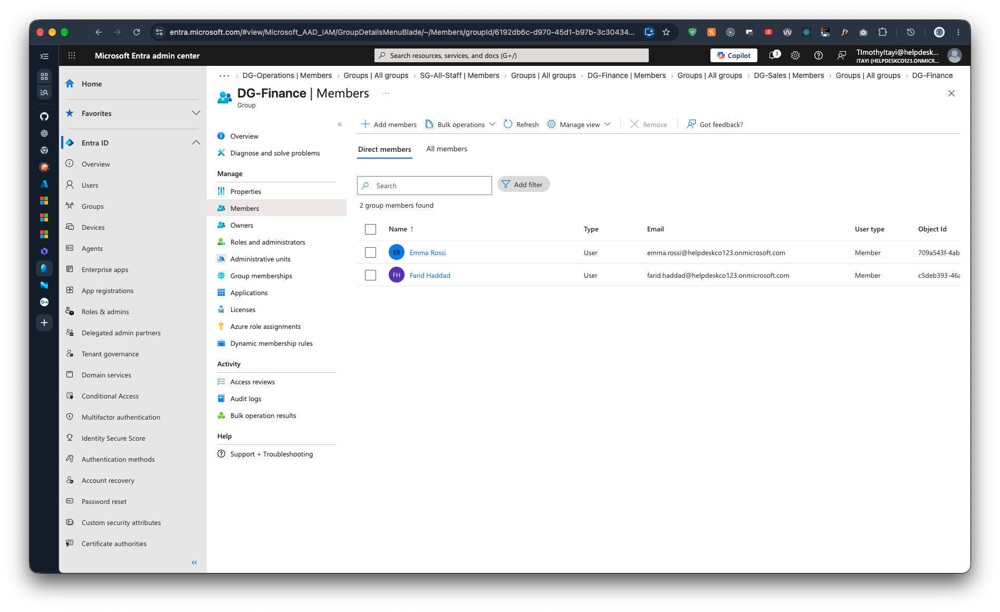

# 2.6 DG-Finance Members

Previous: [04-sg-all-staff-members.md](04-sg-all-staff-members.md)

Decision: [04-groups.md](../../docs/decisions/04-groups.md)

## Steps

In the Entra admin center, go to Groups > DG-Finance > Members.

Expected: Emma Rossi and Farid Haddad.

## Evidence

| Item | Value |
| --- | --- |
| Group | `DG-Finance` |
| Members found | 2 |
| Members | Emma Rossi, Farid Haddad |

This completes the dynamic group checks. `DG-Sales` ([02-dg-sales-members.md](02-dg-sales-members.md)) and `DG-Operations` ([03-dg-operations-members.md](03-dg-operations-members.md)) were already shown, so all three department rules are now evidenced working.
