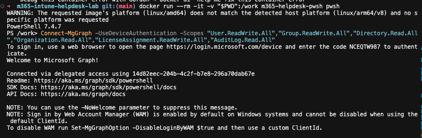
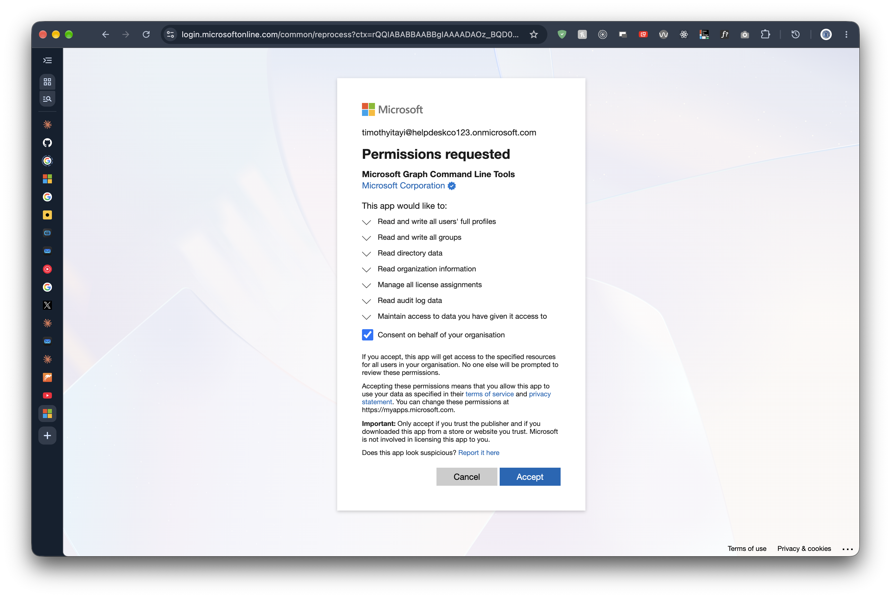
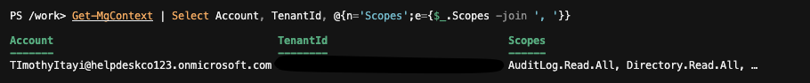

# 3.2 Connect to Microsoft Graph

Previous: [05-dg-finance-members.md](../02-groups/05-dg-finance-members.md)

Decision: [05-scripts.md](../../docs/decisions/05-scripts.md)

## Steps

Enter PowerShell from the repo root (see [Running PowerShell](../../README.md#running-powershell)):

```bash
docker run --rm -it -v "$PWD":/work m365-helpdesk-pwsh pwsh
```

Then, at the `PS /work>` prompt:

```powershell
Connect-MgGraph -UseDeviceAuthentication -Scopes "User.ReadWrite.All","Group.ReadWrite.All","Directory.Read.All","Organization.Read.All","LicenseAssignment.ReadWrite.All","AuditLog.Read.All"
```

1. The terminal prints a device code and asks you to open the Microsoft device login page.
2. On the Mac, open the page, enter the code and sign in as the admin, not the break-glass account.
3. On the consent screen, tick "Consent on behalf of your organisation" (if shown) and accept.
4. The terminal prints `Welcome to Microsoft Graph!`.

Keep the container open for the rest of the phase. If it closes, reconnect.

## Verify

```powershell
Get-MgContext | Select Account, TenantId, @{n='Scopes';e={$_.Scopes -join ', '}}
```

## If stuck

| Problem | Fix |
| --- | --- |
| Device code page says the code has expired | Run `Connect-MgGraph` again for a new code |
| "Need admin approval" | Sign in as a Global Administrator so you can consent |
| Wrong tenant | `Disconnect-MgGraph`, then reconnect with the admin from the right tenant and check `TenantId` |

## Evidence

Device code sign-in from the container:



Consent screen for Microsoft Graph Command Line Tools, with "Consent on behalf of your organisation" ticked:



`Get-MgContext` output, with the tenant ID hidden:



The context shows the admin account and the requested scopes. The scopes column is cut off at the right edge of the screenshot, so only the first few are visible.
