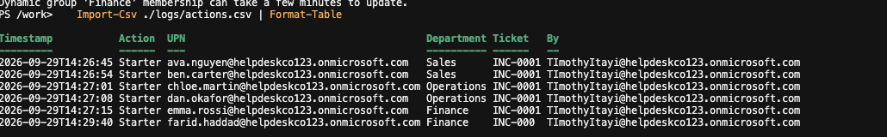

# 3.6 Actions Log

Previous: [04-verify-portals.md](04-verify-portals.md)

Decision: [05-scripts.md](../../docs/decisions/05-scripts.md)

## Steps

```powershell
Import-Csv ./logs/actions.csv | Format-Table
```

Expected: one row per script run. The log file is written by the scripts and is gitignored, so it only exists locally.

## Evidence



| Timestamp | Action | UPN | Department | Ticket |
| --- | --- | --- | --- | --- |
| 2026-09-29T14:26:45 | Starter | `ava.nguyen@helpdeskco123.onmicrosoft.com` | Sales | INC-0001 |
| 2026-09-29T14:26:54 | Starter | `ben.carter@helpdeskco123.onmicrosoft.com` | Sales | INC-0001 |
| 2026-09-29T14:27:01 | Starter | `chloe.martin@helpdeskco123.onmicrosoft.com` | Operations | INC-0001 |
| 2026-09-29T14:27:08 | Starter | `dan.okafor@helpdeskco123.onmicrosoft.com` | Operations | INC-0001 |
| 2026-09-29T14:27:15 | Starter | `emma.rossi@helpdeskco123.onmicrosoft.com` | Finance | INC-0001 |
| 2026-09-29T14:29:40 | Starter | `farid.haddad@helpdeskco123.onmicrosoft.com` | Finance | INC-000 |
| 2026-09-29T15:14:38 | Leaver | `ben.carter@helpdeskco123.onmicrosoft.com` | Leaver | INC-0004 |

The screenshot shows the six starters and was taken before the leaver run. The seventh row is from the `logs/actions.csv` file itself. Every row was written by the admin account.

**Farid's ticket is wrong in the log.** The CSV holds `INC-000`, not `INC-0001`. The command was typed with `-TicketRef INC-000`, and the screenshot cuts it off at the terminal edge. The script accepts any text as a ticket reference and the log is append-only, so the typo stays in the audit trail. It is recorded in the [Phase 3 note](../../docs/phases/03-scripts.md).

The timestamps look like UTC, which is the container default. They read about ten hours behind local time (UTC+10), and this was run around midnight local.
