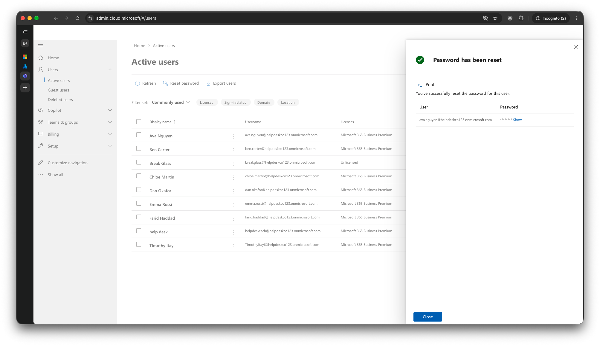
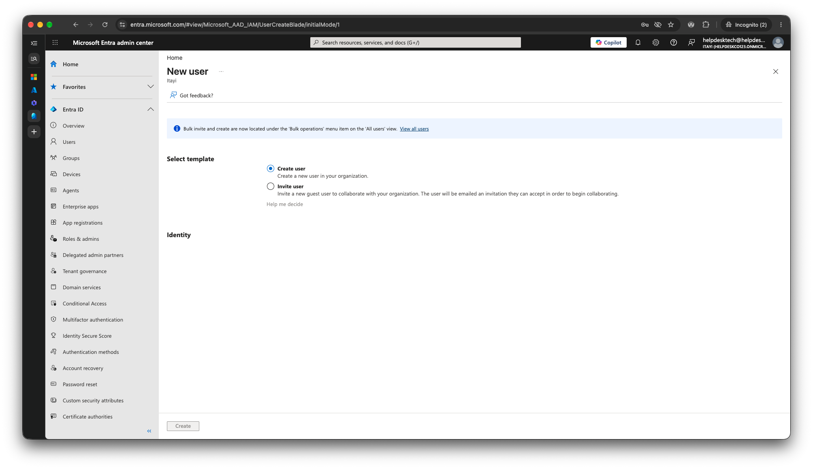

# 3.7 Test the Helpdesk Role (Least Privilege)

Previous: [05-actions-log.md](05-actions-log.md)

Decision: [05-scripts.md](../../docs/decisions/05-scripts.md)

A helpdesk technician should be able to reset a user's password and nothing more. This test checks what the Helpdesk Administrator role can and cannot do.

## Steps

1. In the Microsoft 365 admin center, create a seventh user for the technician, with a Business Premium licence. Give the user the Helpdesk Administrator role (Users > select user > Manage roles).
2. In a private browser window, sign in as that user. Change the temporary password when prompted, then open the Microsoft 365 admin center.
3. Try to reset Ava Nguyen's password.
4. Try to create a new user.

## Result

Helpdesk Administrator could reset a standard user's password but could not create users.

| Action | Result |
| --- | --- |
| Reset Ava Nguyen's password | Worked. The admin center showed "Password has been reset". |
| Create a user in the Microsoft 365 admin center | Not possible. There is no "Add a user" button on the Active users page. |
| Create a user in the Entra admin center | The New user page opens, but the Create button is disabled. |

## Evidence

Active users page in a private window, signed in as the helpdesk user. The toolbar has Refresh, Reset password and Export users, with no "Add a user". The panel confirms the password reset for `ava.nguyen@helpdeskco123.onmicrosoft.com`.

New user page in the Entra admin center, with the Create button disabled.

| Item | Value |
| --- | --- |
| Account | `helpdesktech@helpdeskco123.onmicrosoft.com` (display name "help desk") |
| Licence | Microsoft 365 Business Premium |
| Role | Helpdesk Administrator |

The account was created in the portal, not with `New-Starter.ps1`, so it is not in `logs/actions.csv`. The password reset was also done in the portal and is not logged.
