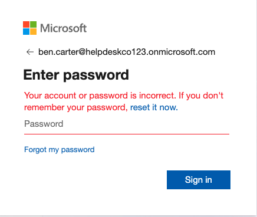

# 3.8 Ben Is Blocked

Previous: [07-leaver-output.md](07-leaver-output.md)

Decision: [05-scripts.md](../../docs/decisions/05-scripts.md)

## Steps

1. In the Microsoft 365 admin center, open Users > Active users > Ben Carter and check the sign-in status.
2. In a private window, try to sign in as Ben. Record the message.

## Evidence

Ben Carter's account page in the Microsoft 365 admin center:

The page shows **Sign-in blocked** in red, with an "Unblock sign-in" action.

Sign-in attempt as Ben in a private window:

The page says: "Your account or password is incorrect. If you don't remember your password, reset it now."

## What this proves

- The admin center screenshot proves the account is blocked.
- The sign-in error does not prove it on its own. It is the same message a wrong password produces, and it does not say the account is disabled. Ben's password was a random temporary one that was shown once and never used, so this attempt may have been a wrong password.
- To show the block is what stopped the sign-in, use Ben's correct password, or check Entra > Monitoring > Sign-in logs for the failure reason.
