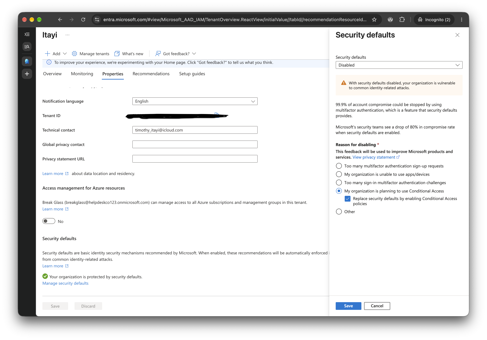

# 4.1 Disable Security Defaults

Previous: [09-tenant-report.md](../03-scripts/09-tenant-report.md)

Decision: [06-conditional-access.md](../../docs/decisions/06-conditional-access.md)

## Steps

New tenants have security defaults on, and the tutorial says Conditional Access policies cannot be created while they are enabled. Turn them off first.

1. Entra admin center > Identity > Overview > Properties > Manage security defaults.
2. Set Security defaults to **Disabled**.
3. Reason: **My organization is planning to use Conditional Access**.
4. Tick **Replace security defaults by enabling Conditional Access policies**, then Save.

The menu labels shift between portal versions. Searching "security defaults" in the Entra search bar finds the panel.

## Evidence

| Setting | Value |
| --- | --- |
| Security defaults | Disabled |
| Reason | My organization is planning to use Conditional Access |
| Replace with Conditional Access policies | Ticked |

The tenant ID is blacked out in the screenshot.

## What this proves

The screenshot shows the panel filled in with the **Save** button still visible, so it shows the setting before it was saved, not after. The saved state is only inferred: three Conditional Access policies were created afterwards ([02-policy-list-report-only.md](02-policy-list-report-only.md)), and the tutorial says that cannot be done with security defaults on. If it matters, re-open the panel and screenshot it after saving.

Turning security defaults off removes the blanket MFA prompt they gave every user. From this point, MFA is only enforced by Conditional Access policies, and the policies in this phase are report-only. See the Microsoft-managed policies noted in [02-policy-list-report-only.md](02-policy-list-report-only.md).
