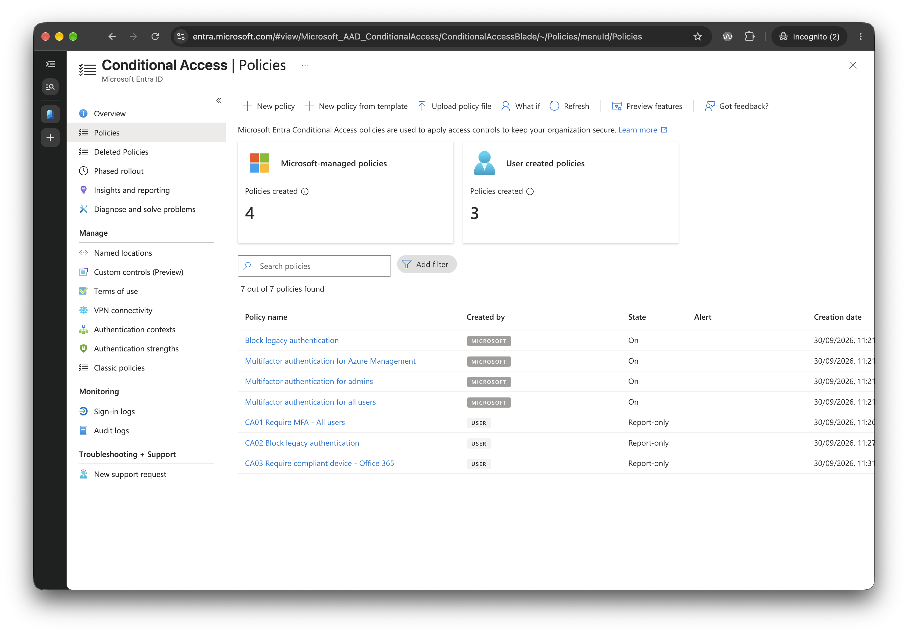

# 4.2 Policy List: All Three in Report-Only

Previous: [01-ca01-settings.md](01-ca01-settings.md)

Decision: [06-conditional-access.md](../../docs/decisions/06-conditional-access.md)

## Steps

Create the other two policies the same way as CA01, then open Protection > Conditional Access > Policies.

| Policy | Users | Target resources | Condition and grant | State |
| --- | --- | --- | --- | --- |
| `CA02 Block legacy authentication` | All users, exclude break-glass | All cloud apps | Client apps: Exchange ActiveSync clients and Other clients. Grant: Block access | Report-only |
| `CA03 Require compliant device - Office 365` | Include `SG-All-Staff`, exclude break-glass and the admin | Office 365 | Grant: Require device to be marked as compliant | Report-only. Stays here until Phase 6 |

## Evidence

The list shows 7 policies out of 7, made up of 3 user-created and 4 Microsoft-managed.

| Policy | Created by | State | Created |
| --- | --- | --- | --- |
| CA01 Require MFA - All users | User | Report-only | 30/09/2026, 11:26 |
| CA02 Block legacy authentication | User | Report-only | 30/09/2026, 11:27 |
| CA03 Require compliant device - Office 365 | User | Report-only | 30/09/2026, 11:31 |
| Block legacy authentication | Microsoft | On | |
| Multifactor authentication for Azure Management | Microsoft | On | |
| Multifactor authentication for admins | Microsoft | On | |
| Multifactor authentication for all users | Microsoft | On | |

## What this proves, and what it doesn't

- All three policies exist and are Report-only, so none of them blocks anyone yet.
- The settings of CA02 and CA03 are not shown. The list proves the names and the state. It does not prove the client apps ticked in CA02, or the group, exclusions and target app in CA03. Only CA01 has a settings screenshot, and that is partial ([01-ca01-settings.md](01-ca01-settings.md)).
- **The four Microsoft-managed policies are On.** I did not create them, and they are not covered by the break-glass exclusion set in CA01. Two of them are MFA for all users and MFA for admins, and the break-glass account is a Global Admin. I don't know whether Microsoft's policies exclude any accounts, and I have not opened them. Check their exclusions before relying on the break-glass account, because report-only on CA01 does not stop these from acting.
- Report-only logs what would have happened in the sign-in logs and enforces nothing. The next step checks a sign-in against these policies ([04-signin-log-ca-tab.md](04-signin-log-ca-tab.md)).
- This screenshot is the last one showing the policies' state. Nothing later shows whether CA01 or CA02 were switched to On.
