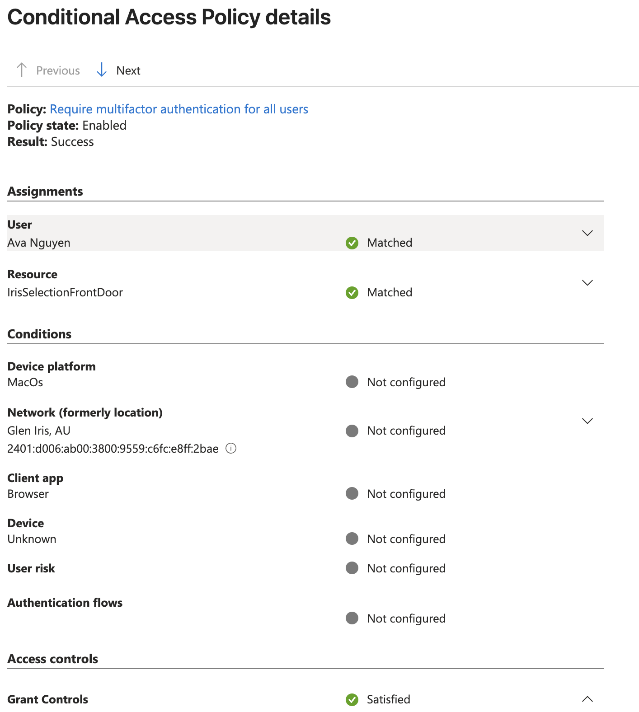

# 4.3 Sign-in Log: Conditional Access Details for Ava

Previous: [03-ava-mfa-prompt.md](03-ava-mfa-prompt.md)

Decision: [06-conditional-access.md](../../docs/decisions/06-conditional-access.md)

## Steps

Entra admin center > Monitoring & health > Sign-in logs. Open Ava's sign-in, select the Conditional Access tab, then open a policy.

The Conditional Access details show which policy applied, its state and its result.

## Evidence

| Field | Value |
| --- | --- |
| Policy | Require multifactor authentication for all users |
| Policy state | Enabled |
| Result | Success |
| User | Ava Nguyen: Matched |
| Resource | IrisSelectionFrontDoor: Matched |
| Device platform | MacOs |
| Client app | Browser |
| Device | Unknown |
| Network | Glen Iris, AU (IP address in the screenshot) |
| Grant controls | Satisfied |

The conditions listed (platform, network, client app, device, user risk, authentication flows) are all marked "Not configured", meaning the policy does not filter on them.

## Result

An MFA policy applied to Ava's sign-in and its grant control was satisfied, which fits the MFA prompt in [03-ava-mfa-prompt.md](03-ava-mfa-prompt.md).
