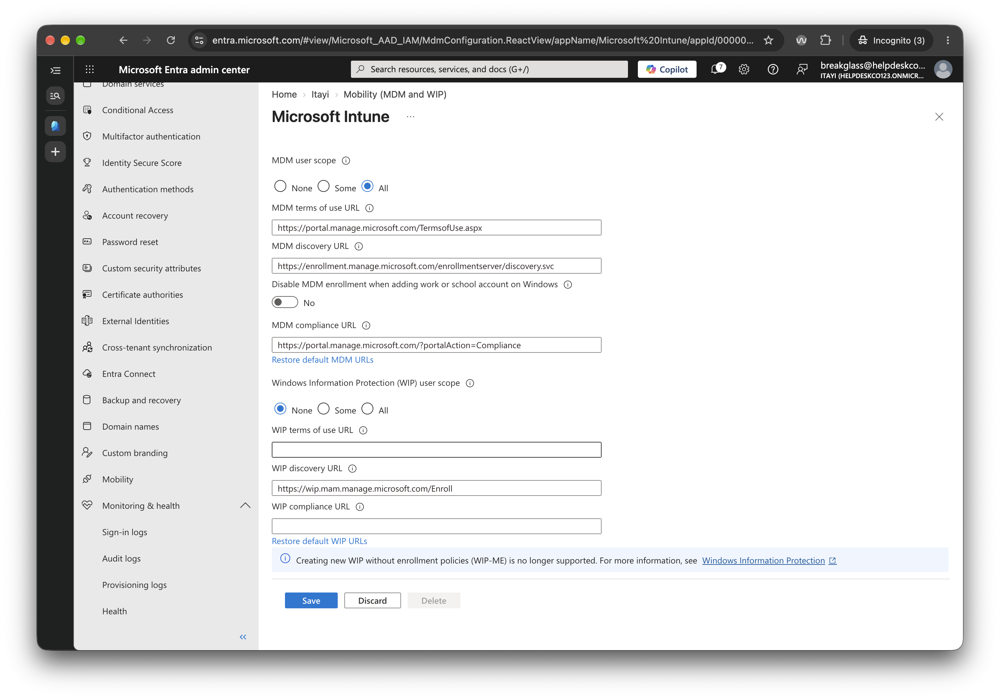

# 5.1 Automatic Enrolment: MDM User Scope

Previous: [04-signin-log-ca-tab.md](../04-conditional-access/04-signin-log-ca-tab.md)

Decision: [07-intune.md](../../docs/decisions/07-intune.md)

## Steps

Entra admin center > Entra ID > Mobility (MDM and WIP) > Microsoft Intune. Set MDM user scope to **All** (or Some with `SG-All-Staff`), then Save.

Without this, devices that join Entra never appear in Intune.

## Evidence

| Setting | Value |
| --- | --- |
| MDM user scope | All |
| MDM terms of use URL | `https://portal.manage.microsoft.com/TermsofUse.aspx` |
| MDM discovery URL | `https://enrollment.manage.microsoft.com/enrollmentserver/discovery.svc` |
| Disable MDM enrollment when adding work or school account on Windows | No |
| WIP user scope | None |

## What this proves, and what it doesn't

- MDM user scope is set to All.
- Save and Discard are active in the screenshot. The scope is taken as saved, because the setup carried on from this page. The screenshot itself doesn't show the saved state, and no device enrolment was tried, so nothing tests it.
- The screenshot was taken while signed in as the **break-glass account** (`breakglass@helpdeskco…`, top right), not the admin. That account is used to read the sign-in logs, and this page was captured in the same session ([05-intune.md](../../docs/phases/05-intune.md)).
- The URLs are Microsoft's defaults, not values I set.
