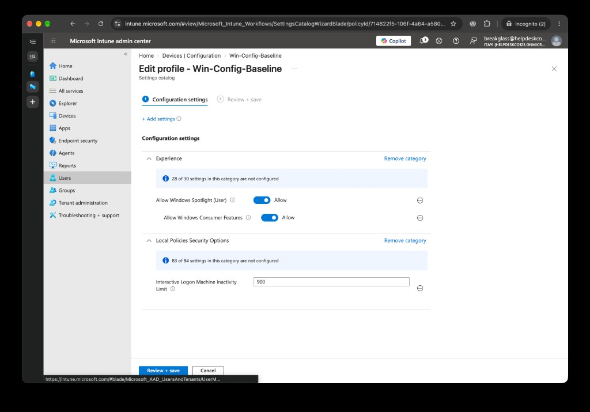

# 5.3 Configuration Profile

Previous: [01-compliance-policy.md](01-compliance-policy.md)

Decision: [07-intune.md](../../docs/decisions/07-intune.md)

## Steps

Intune admin center > Devices > Configuration > Create > New policy > Windows 10 and later > Settings catalog.

| Setting | Value |
| --- | --- |
| Name | `Win-Config-Baseline` |
| Machine inactivity limit | 900 seconds |
| Microsoft consumer experiences | Turned off |
| Assignments | `SG-All-Staff` |

## Evidence

The settings page of the created profile (Edit profile, step 1 of 2):

| Category | Setting | Value |
| --- | --- | --- |
| Experience (2 of 30 configured) | Allow Windows Spotlight (User) | Allow |
| Experience | Allow Windows Consumer Features | **Allow** |
| Local Policies Security Options (1 of 84 configured) | Interactive Logon Machine Inactivity Limit | 900 |

The Review + create page from when the profile was made:

It shows the same two Experience settings and an **empty** Included groups table.

## What this proves, and what it doesn't

- The profile exists. The Edit profile page is only available for a saved profile.
- **The machine inactivity limit is 900**, which is the 15 minutes planned.
- **Consumer features are not turned off.** Allow Windows Consumer Features is set to Allow on the saved profile. The tutorial asked for Microsoft consumer experiences to be turned off. Either the setting was left on, or Allow is the wrong value for the intent. To turn them off, set it to Block or Disabled, whichever the picker offers, and record the change.
- **The assignment to `SG-All-Staff` is still not shown.** The review page shows the Included groups table empty, and the settings page doesn't cover assignments. Open the profile's Properties > Assignments to show the group.
- The review page is from before Create. It was taken as the profile was being made, and the settings page confirms it was created.
