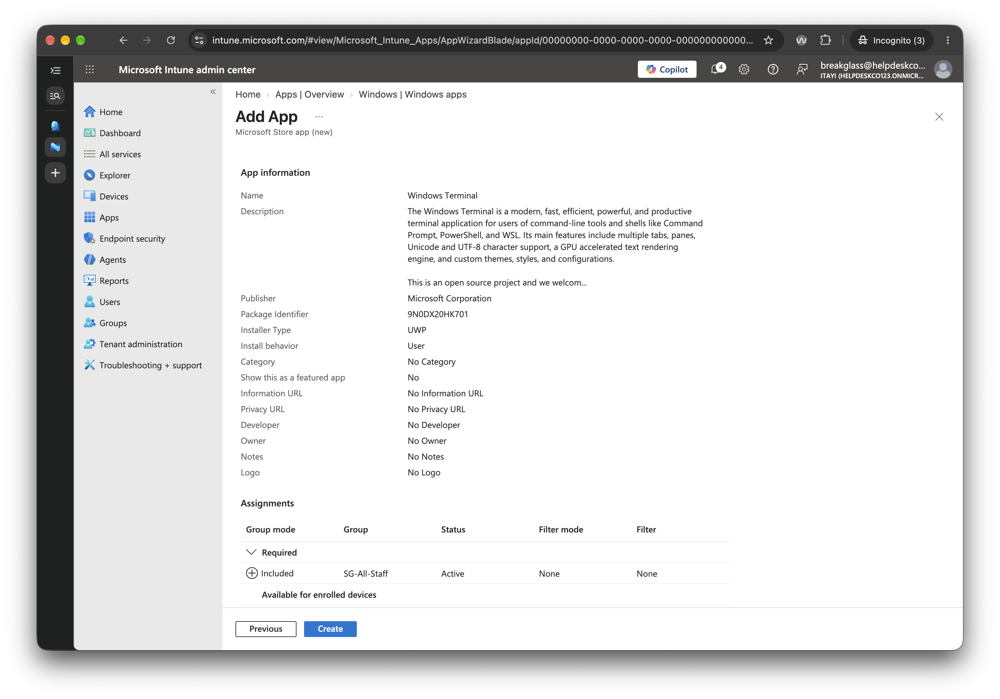

# 5.5 Deploy an App

Previous: [03-update-ring.md](03-update-ring.md)

Decision: [07-intune.md](../../docs/decisions/07-intune.md)

## Steps

Intune admin center > Apps > Windows > Create > Microsoft Store app (new). Search for a free app, then set the assignment to Required for `SG-All-Staff`.

## Evidence

The screenshot is the **Review + create** page of the Add App wizard.

| Item | Value shown |
| --- | --- |
| App | Windows Terminal, Microsoft Corporation |
| Package identifier | `9N0DX20HK701` |
| Installer type | UWP |
| Install behavior | User |
| Required | `SG-All-Staff`, Active, no filter |
| Available for enrolled devices | Empty |
| Uninstall | Empty |

## Result

Windows Terminal is assigned as Required for `SG-All-Staff`, installing for the signed-in user.
