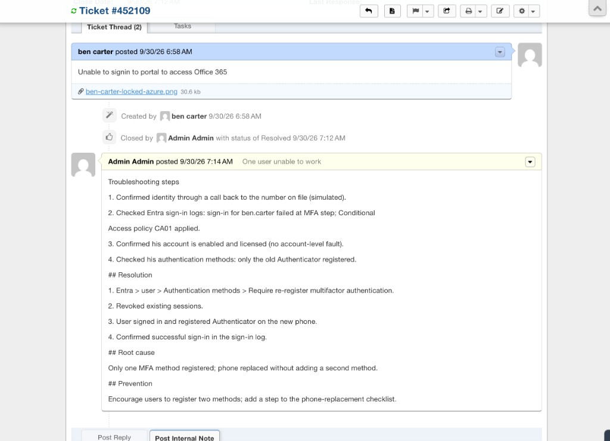
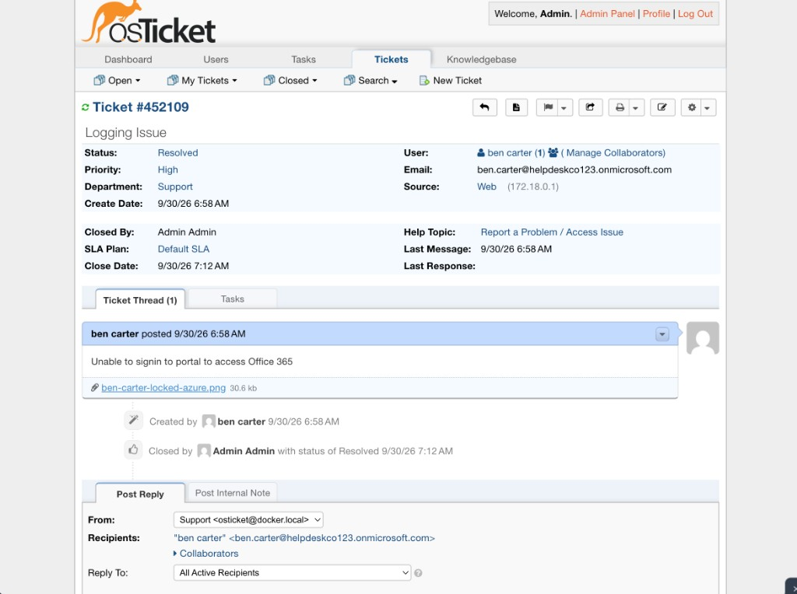

# osTicket #452109: Ben Carter unable to sign in

Previous: [08-scope.md](../docs/decisions/08-scope.md)

This is the one sample ticket in the repo. Tickets are not the focus of this lab ([08-scope.md](../docs/decisions/08-scope.md)).

## Ticket

| Field | Value |
| --- | --- |
| Ticket | #452109, status Resolved |
| Requester | Ben Carter (`ben.carter@helpdeskco123.onmicrosoft.com`) |
| Subject | Unable to signin to portal to access Office 365 |
| Priority | High |
| Department | Support |
| Help topic | Report a Problem / Access Issue |
| Source | Web |
| Opened | 9/30/26, 6:58 AM |
| Closed | 9/30/26, 7:12 AM, by Admin Admin |
| Time to resolve | 14 minutes, from the open and close times |

The times are as osTicket shows them. They look like UTC against a local time of UTC+10, but I haven't checked the server's timezone.

## Evidence

The ticket thread, with the requester's message, the attachment and the resolution note:

The ticket details:

The requester's attachment, `ben-carter-locked-azure.png`, is the sign-in page from Phase 3: "Your account has been locked. Contact your support person to unlock it, then try again." ([08-ben-blocked.md](../evidence/03-scripts/08-ben-blocked.md)).

## The resolution note does not match the record

The note on the ticket says the sign-in failed at the MFA step, that CA01 was applied, that only an old Authenticator was registered, and that MFA was re-registered after a phone replacement. The rest of this repo says otherwise:

| What the note says | What the repo shows |
| --- | --- |
| Sign-in failed at the MFA step | Ben's account was blocked by `Remove-Leaver.ps1` and his sign-in showed "account has been locked" ([07-leaver-output.md](../evidence/03-scripts/07-leaver-output.md)) |
| CA01 was applied | CA01 was Report-only when last shown, and Ben never signed in with MFA ([04-conditional-access.md](../docs/phases/04-conditional-access.md)) |
| Only an old Authenticator was registered, phone replaced | No Authenticator was registered for Ben, and there was no phone replacement |
| MFA re-registered, successful sign-in logged | Ben's account is still blocked, licences removed, department `Leaver` ([09-tenant-report.md](../evidence/03-scripts/09-tenant-report.md)) |
| Identity verified by a call-back | Simulated, as the note itself says |

The note is the tutorial's example text (an MFA lockout after a phone change), not a description of what was done to Ben's account. The ticket is best read as a staged example.

## What the resolution would truthfully say

If this ticket is to stand as a record, the note on it should say something like:

- Ben Carter's account was disabled by the leaver process, run with ticket INC-0004. His sign-in is blocked on purpose, so the "account has been locked" message is expected.
- Checked: Microsoft 365 admin center shows Sign-in blocked for Ben, licences removed, department `Leaver`.
- Resolution: no fault. Confirmed with the requester that the leaver request stands. If it doesn't, use "Unblock sign-in" in the admin center and restore licences.
- Root cause: expected behaviour after offboarding.

That would also fit the evidence in [08-ben-blocked.md](../evidence/03-scripts/08-ben-blocked.md).

## Related

- Runbook for the MFA scenario the note describes: [mfa-re-registration.md](../docs/runbooks/mfa-re-registration.md). It has not been run against a real incident.
